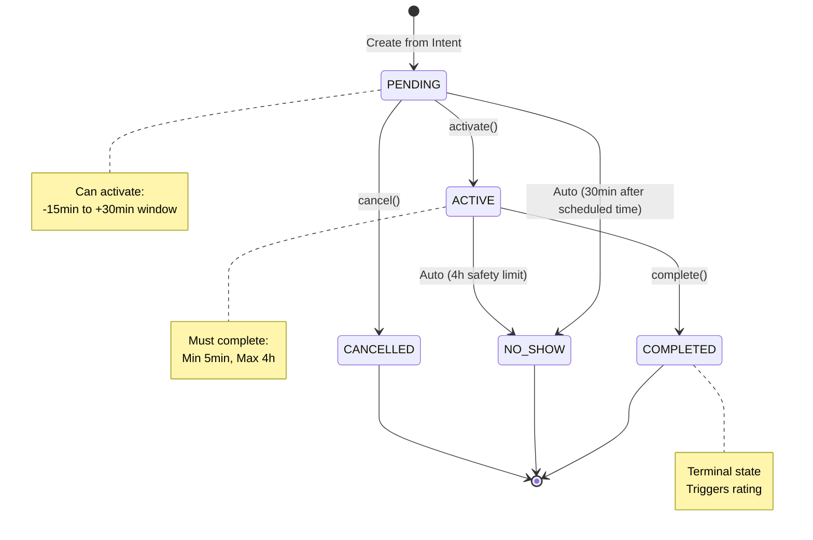

# WalkMate Domain Model (DDD-lite)

**Core Entities:** WalkIntent | WalkSession | User  
**Key Pattern:** 2-Phase Model (Coordination → Lifecycle)  
**Date:** March 6, 2026

---

## 1. Two-Phase Model

```
┌──────────────────────┐         ┌────────────────────────┐
│  PHASE 1: INTENT     │         │   PHASE 2: SESSION     │
│  (Coordination)      │  ────>  │   (Lifecycle)          │
│                      │         │                        │
│  - WalkIntent        │         │   - WalkSession        │
│  - Matching          │         │   - State Machine      │
│  - Confirmation      │         │   - Accountability     │
└──────────────────────┘         └────────────────────────┘
     Reversible                      Irreversible
```

**Value Realization Point:** WalkSession creation (after mutual confirmation)

---

## 2. Core Entities

### WalkIntent (Coordination Phase)

```java
@Entity
public class WalkIntent {
    @Id
    private UUID id;
    
    private UUID creator;         // User who created intent
    private UUID partner;          // Matched user (nullable)
    
    private LocalDateTime scheduledTime;
    private Duration duration;
    
    @Embedded
    private Location meetingPoint;
    
    @Enumerated(EnumType.STRING)
    private IntentStatus status;  // OPEN, MATCHED, CONFIRMED, USED, EXPIRED
    
    private boolean creatorConfirmed;
    private boolean partnerConfirmed;
    
    private LocalDateTime createdAt;
    
    // Business method
    public boolean isMutuallyConfirmed() {
        return creatorConfirmed && partnerConfirmed;
    }
}
```

**Repository:**

```java
public interface IntentRepository extends JpaRepository<WalkIntent, UUID> {
    
    List<WalkIntent> findByCreatorAndStatus(UUID creator, IntentStatus status);
    
    @Query("SELECT i FROM WalkIntent i WHERE i.status = 'OPEN' " +
           "AND i.scheduledTime > :now ORDER BY i.scheduledTime")
    List<WalkIntent> findOpenIntents(@Param("now") LocalDateTime now);
}
```

---

### WalkSession (Lifecycle Phase - **Aggregate Root**)

```java
@Entity
@Table(name = "walk_sessions")
public class WalkSession {
    
    @Id
    private UUID id;
    
    @Enumerated(EnumType.STRING)
    private SessionStatus status;  // State machine!
    
    @Version
    private Long version;  // Optimistic locking
    
    private UUID participant1;
    private UUID participant2;
    
    private LocalDateTime scheduledStartTime;
    private LocalDateTime scheduledEndTime;
    
    private LocalDateTime actualStartTime;
    private LocalDateTime actualEndTime;
    
    private LocalDateTime createdAt;
    private LocalDateTime updatedAt;
    
    // ===== BEHAVIORAL METHODS =====
    
    /**
     * PENDING → ACTIVE
     * Guards: within activation window, user is participant, state is PENDING
     */
    public void activate(UUID userId, LocalDateTime now) {
        // Guard: state
        if (status != SessionStatus.PENDING) {
            throw new InvalidStateTransitionException(
                "Can only activate from PENDING, current: " + status
            );
        }
        
        // Guard: participant
        if (!isParticipant(userId)) {
            throw new UnauthorizedActionException("Not a participant");
        }
        
        // Guard: time window (-15min to +30min)
        LocalDateTime windowStart = scheduledStartTime.minusMinutes(15);
        LocalDateTime windowEnd = scheduledStartTime.plusMinutes(30);
        
        if (now.isBefore(windowStart) || now.isAfter(windowEnd)) {
            throw new ActivationWindowExpiredException(
                "Window: " + windowStart + " to " + windowEnd
            );
        }
        
        // State transition
        this.status = SessionStatus.ACTIVE;
        this.actualStartTime = now;
        this.updatedAt = now;
    }
    
    /**
     * ACTIVE → COMPLETED
     * Guards: minimum duration (5min), safety limit (4h)
     */
    public void complete(UUID userId, LocalDateTime now) {
        if (status != SessionStatus.ACTIVE) {
            throw new InvalidStateTransitionException("Must be ACTIVE");
        }
        if (!isParticipant(userId)) {
            throw new UnauthorizedActionException();
        }
        
        Duration duration = Duration.between(actualStartTime, now);
        if (duration.toMinutes() < 5) {
            throw new MinimumDurationNotMetException();
        }
        if (duration.toHours() > 4) {
            throw new SafetyLimitExceededException();
        }
        
        this.status = SessionStatus.COMPLETED;
        this.actualEndTime = now;
        this.updatedAt = now;
    }
    
    /**
     * PENDING → CANCELLED (before start)
     */
    public void cancel(UUID userId, LocalDateTime now) {
        if (status != SessionStatus.PENDING) {
            throw new InvalidStateTransitionException();
        }
        if (!isParticipant(userId)) {
            throw new UnauthorizedActionException();
        }
        
        this.status = SessionStatus.CANCELLED;
        this.updatedAt = now;
    }
    
    /**
     * PENDING → NO_SHOW (auto-triggered after grace period expires)
     */
    public void markAsNoShow(LocalDateTime now) {
        if (status != SessionStatus.PENDING && status != SessionStatus.ACTIVE) {
            throw new InvalidStateTransitionException();
        }
        
        this.status = SessionStatus.NO_SHOW;
        this.updatedAt = now;
    }
    
    // ===== HELPERS =====
    
    public boolean isParticipant(UUID userId) {
        return participant1.equals(userId) || participant2.equals(userId);
    }
    
    public boolean isTerminal() {
        return status == SessionStatus.COMPLETED 
            || status == SessionStatus.NO_SHOW 
            || status == SessionStatus.CANCELLED;
    }
}
```

**SessionStatus Enum:**

```java
public enum SessionStatus {
    PENDING,    // Created, waiting for activation
    ACTIVE,     // Walk in progress
    COMPLETED,  // Successfully finished
    NO_SHOW,    // No one activated in time
    CANCELLED   // Cancelled before start
}
```

**Repository:**

```java
public interface SessionRepository extends JpaRepository<WalkSession, UUID> {
    
    /**
     * Find active/pending session for a user (enforce single active session invariant)
     */
    @Query("SELECT s FROM WalkSession s WHERE " +
           "(s.participant1 = :userId OR s.participant2 = :userId) " +
           "AND s.status IN ('PENDING', 'ACTIVE')")
    Optional<WalkSession> findActiveSessionByUser(@Param("userId") UUID userId);
    
    /**
     * Find expired PENDING sessions for auto-NO_SHOW job
     */
    @Query("SELECT s FROM WalkSession s WHERE " +
           "s.status = 'PENDING' AND s.scheduledStartTime < :cutoff")
    List<WalkSession> findExpiredPendingSessions(@Param("cutoff") LocalDateTime cutoff);
    
    /**
     * Find active sessions exceeding safety limit for auto-COMPLETE job
     */
    @Query("SELECT s FROM WalkSession s WHERE " +
           "s.status = 'ACTIVE' AND s.actualStartTime < :cutoff")
    List<WalkSession> findLongRunningSessions(@Param("cutoff") LocalDateTime cutoff);
}
```

---

### User (Referenced Entity)

```java
@Entity
@Table(name = "users")
public class User {
    
    @Id
    private UUID id;  // From Supabase Auth (JWT subject)
    
    private String email;
    private String displayName;
    
    @Embedded
    private UserProfile profile;
    
    private int trustScore;  // Updated after each session
    private int completedWalks;
    private int noShowCount;
    
    private LocalDateTime createdAt;
    private LocalDateTime lastActiveAt;
}
```

**Note:** User management (signup/login) is handled by Supabase Auth. Backend only stores additional profile data.

---

## 3. State Machine Diagram



**State Transition Rules:**

| From      | To        | Trigger             | Who               | Conditions                         |
| --------- | --------- | ------------------- | ----------------- | ---------------------------------- |
| PENDING   | ACTIVE    | `activate()`        | Either participant| Within activation window           |
| PENDING   | CANCELLED | `cancel()`          | Either participant| Before scheduled time              |
| PENDING   | NO_SHOW   | Auto (job)          | System            | 30min after scheduled time         |
| ACTIVE    | COMPLETED | `complete()`        | Either participant| Duration: 5min - 4h                |
| ACTIVE    | NO_SHOW   | Auto (job)          | System            | 4h after actual start              |

**Terminal States (Immutable):**

- COMPLETED
- NO_SHOW  
- CANCELLED

Once a session reaches terminal state, no further transitions allowed.

---

## 4. Value Objects

### Location

```java
@Embeddable
public class Location {
    private Double latitude;
    private Double longitude;
    private String address;  // Human-readable address (optional)
    
    public Distance distanceTo(Location other) {
        // Haversine formula
        // ...
        return new Distance(meters);
    }
}
```

### Distance

```java
public record Distance(double meters) {
    
    public double kilometers() {
        return meters / 1000.0;
    }
    
    public boolean isWithinWalkingDistance(double maxKm) {
        return kilometers() <= maxKm;
    }
}
```

---

## 5. Domain Exceptions

```java
// Base
public abstract class DomainException extends RuntimeException {
    protected DomainException(String message) {
        super(message);
    }
}

// State machine violations
public class InvalidStateTransitionException extends DomainException { }
public class ActivationWindowExpiredException extends DomainException { }
public class MinimumDurationNotMetException extends DomainException { }
public class SafetyLimitExceededException extends DomainException { }

// Authorization
public class UnauthorizedActionException extends DomainException { }

// Business invariants
public class UserAlreadyHasActiveSessionException extends DomainException { }
public class MutualConfirmationRequiredException extends DomainException { }
```

HTTP mapping in `GlobalExceptionHandler`:

- `InvalidStateTransitionException` → 409 CONFLICT
- `UnauthorizedActionException` → 403 FORBIDDEN
- `ActivationWindowExpiredException` → 400 BAD_REQUEST
- `OptimisticLockException` → 409 CONFLICT

---

## 6. Cross-Aggregate Invariant

**Invariant:** A user can have **at most ONE active/pending session at any time.**

**Enforcement Location:** Application Service (during session creation)

```java
@Service
@Transactional
public class SessionApplicationService {
    
    public SessionResponse createSession(CreateSessionCommand cmd) {
        // Check invariant for both participants
        if (sessionRepo.findActiveSessionByUser(cmd.participant1()).isPresent()) {
            throw new UserAlreadyHasActiveSessionException(cmd.participant1());
        }
        if (sessionRepo.findActiveSessionByUser(cmd.participant2()).isPresent()) {
            throw new UserAlreadyHasActiveSessionException(cmd.participant2());
        }
        
        // Create session
        WalkSession session = WalkSession.fromIntent(...);
        sessionRepo.save(session);
        
        return SessionMapper.toResponse(session);
    }
}
```

**Why in Service, not Domain?**

- Requires querying across aggregates (both users' sessions)
- Transaction boundary needed to prevent race conditions
- This is a **cross-aggregate invariant**, not single-aggregate business rule

---

## Summary

**Core Concepts:**

1. **Two-Phase Model:** Intent (reversible) → Session (irreversible)
2. **Aggregate Root:** WalkSession enforces all lifecycle rules
3. **State Machine:** 5 states with strict transition rules
4. **Optimistic Locking:** `@Version` field prevents concurrent modifications
5. **Behavioral Methods:** `activate()`, `complete()`, `cancel()` contain business logic
6. **Cross-Aggregate Invariant:** Enforced in Application Service with transaction

**Entities:**

- **WalkIntent:** Coordination phase, matching, confirmation
- **WalkSession:** Lifecycle phase, state machine, accountability
- **User:** Referenced entity (managed by Supabase Auth)

**Value Objects:**

- Location, Distance

**Repositories:**

- IntentRepository, SessionRepository (JPA interfaces)

---

**END OF DOCUMENT**
