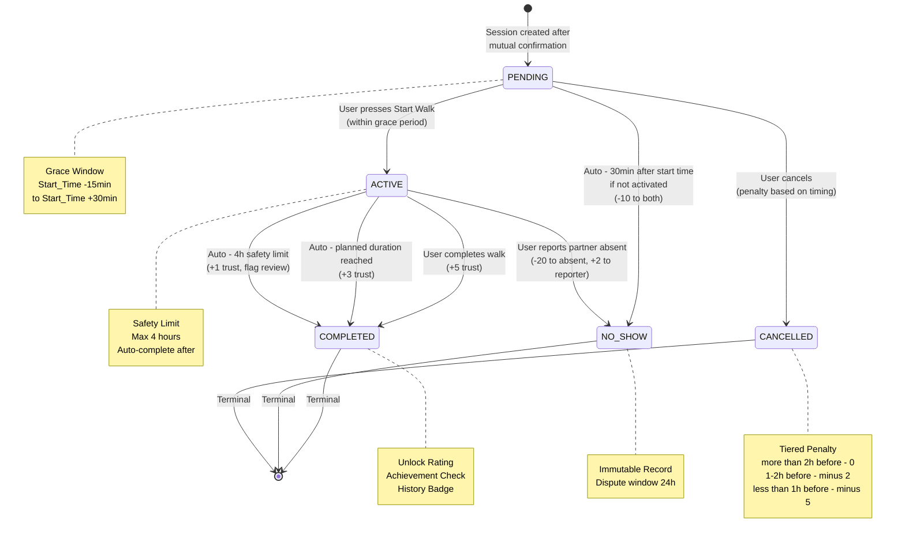
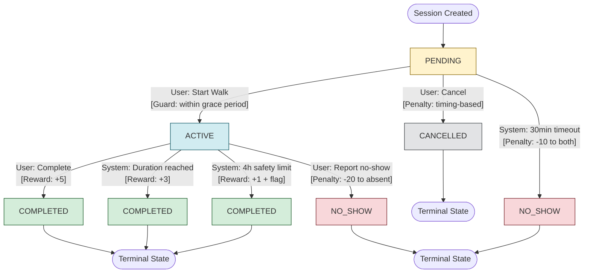

đ# WalkSession State Machine — Final Version

**Domain Architect:** DDD-based Reconciliation  
**Date:** March 6, 2026  
**Aggregate Root:** WalkSession  
**System Type:** Ephemeral Real-World Coordination System

---

## Executive Summary: Key Reconciliation Decisions

Before diving into the final state machine, here are the **7 major differences** between the two models and how they were resolved:

1. **State Count Difference**
   - **Teammate's model:** 7 states (PENDING, MATCHED, CONFIRMED, IN_PROGRESS, COMPLETED, CANCELLED, NO_SHOW)
   - **My model (SYSTEM CONSTRUCTION):** 5 states (PENDING, ACTIVE, COMPLETED, NO_SHOW, CANCELLED)
   - **Resolution:** Use 5-state model. MATCHED/CONFIRMED belong to coordination phase, not WalkSession aggregate.

2. **Phase Boundary Violation**
   - **Teammate's model:** Treats matching and confirmation as session states
   - **My model:** Clear separation between Coordination Phase (WalkIntent) and Lifecycle Phase (WalkSession)
   - **Resolution:** WalkSession only manages lifecycle. MATCHED/CONFIRMED are coordination concerns handled by WalkIntent/MatchSuggestion aggregates.

3. **Value Realization Point**
   - **Teammate's model:** Implies value starts at MATCHED
   - **My model:** Value only realized through completed walk
   - **Resolution:** Session creation happens AFTER mutual confirmation. The confirmation itself is pre-value.

4. **State Naming**
   - **Teammate's model:** IN_PROGRESS
   - **My model:** ACTIVE
   - **Resolution:** Use ACTIVE (semantically clearer for real-time coordination).

5. **Timeout Granularity**
   - **Teammate's model:** Detailed timeout rules (24h, 48h, 15min grace periods)
   - **My model:** High-level transition rules
   - **Resolution:** Incorporate teammate's timeout specifications as guard conditions and scheduled jobs.

6. **Penalty/Reliability System**
   - **Teammate's model:** Explicit reliability score adjustments (-5, -10, -20 points)
   - **My model:** Conceptual trust penalties without specific values
   - **Resolution:** Adopt teammate's penalty framework but implement as domain events (not direct state responsibility).

7. **Cancellation Policy**
   - **Teammate's model:** Time-based penalty tiers (>2h, <2h, <15min before start)
   - **My model:** Simple cancellation from PENDING only
   - **Resolution:** Incorporate tiered cancellation rules but constrain to PENDING state (cannot cancel ACTIVE walks).

---

# 1. Final State Set for WalkSession

## Core States (5 Total)

### PENDING

**Semantics:** Session created and confirmed, awaiting activation within scheduled time window.

**When it exists:**

- After mutual confirmation (coordination phase completed)
- Before scheduled start time
- Before either participant activates

**Why it exists:**

- Preparation period between commitment and execution
- Grace period for legitimate cancellations
- Clear distinction between "scheduled" vs "happening now"

**Terminal:** No  
**Can transition to:** ACTIVE, CANCELLED, NO_SHOW

---

### ACTIVE

**Semantics:** Walk is currently in progress; real-time coordination happening.

**When it exists:**

- At least one participant pressed "Start Walk" within time window
- Walk duration has not exceeded maximum threshold
- Neither participant has completed/ended

**Why it exists:**

- Track real-time walk execution
- Enable safety features (location sharing, emergency contact)
- Detect actual participation vs no-show
- Measure actual walk duration for achievements

**Terminal:** No  
**Can transition to:** COMPLETED, NO_SHOW

---

### COMPLETED

**Semantics:** Walk successfully finished; both participants fulfilled commitment.

**When it exists:**

- Walk reached destination or planned duration
- Either participant marked "Complete"
- Both users were present (verified by activation)

**Why it exists:**

- Distinguish success from failure
- Enable rating/feedback
- Increase trust score
- Trigger achievement calculations

**Terminal:** ✅ **YES — IMMUTABLE**  
**Side effects:** Unlock rating, positive trust adjustment, achievement check

---

### NO_SHOW

**Semantics:** At least one participant failed to show up; commitment broken.

**When it exists:**

- User reported partner no-show during ACTIVE
- Auto-detected: Session not activated within grace period after start time
- Disputed no-show (handled separately)

**Why it exists:**

- Accountability for wasted time
- Trust penalty enforcement
- Distinguish flaking from legitimate cancellation
- Prevent serial no-show abuse

**Terminal:** ✅ **YES — IMMUTABLE**  
**Side effects:** Trust penalty (-10 to -20 points), dispute window opens

---

### CANCELLED

**Semantics:** Session cancelled before walk started; legitimate withdrawal with notice.

**When it exists:**

- User cancelled from PENDING state
- Cancellation with valid reason
- Before time window begins

**Why it exists:**

- Allow flexibility for life events
- Distinguish from no-show (less severe penalty)
- Immediate resource release (both users can create new intent)
- Track cancellation patterns without harsh punishment

**Terminal:** ✅ **YES — IMMUTABLE**  
**Side effects:** Minor trust penalty (0 to -5 points, based on timing), notification to partner

---

## State Classification

**Active States (not terminal):**

- PENDING
- ACTIVE

**Terminal States (immutable):**

- COMPLETED
- NO_SHOW
- CANCELLED

**Principle:** Terminal states are permanent historical records. Corrections happen via dispute/compensation events, NOT state mutation.

---

# 2. Final Transition Specification

## 2.1 Complete Transition Table

| From    | To        | Trigger                      | Actor              | Preconditions / Guards                                                                                          | Side Effects (Domain Events)                                                     | Timeout / Auto Rule                            | Penalty / Score Impact                                                  |
| ------- | --------- | ---------------------------- | ------------------ | --------------------------------------------------------------------------------------------------------------- | -------------------------------------------------------------------------------- | ---------------------------------------------- | ----------------------------------------------------------------------- |
| PENDING | ACTIVE    | User presses "Start Walk"    | Either participant | • Current time ≥ Start_Time - 15min (grace period)<br>• Current time ≤ Start_Time + 30min<br>• Status = PENDING | • WalkSessionActivated<br>• ActualStartTimeRecorded<br>• NotifyPartner           | N/A                                            | No penalty                                                              |
| PENDING | CANCELLED | User cancels session         | Either participant | • Status = PENDING<br>• Cancellation reason provided<br>• Timing determines penalty tier                        | • SessionCancelled<br>• CancellationReasonRecorded<br>• NotifyPartner            | N/A                                            | **Tiered:**<br>• >2h before: 0<br>• 1-2h before: -2<br>• <1h before: -5 |
| PENDING | NO_SHOW   | Time window expired          | System (scheduler) | • Current time > Start_Time + 30min (grace period)<br>• Status still = PENDING<br>• Activation count = 0        | • SessionNoShow<br>• BothUsersMarkedAbsent<br>• NotifyBoth                       | **Auto: 30min after Start_Time**               | -10 to both (ambiguous fault)                                           |
| ACTIVE  | COMPLETED | User completes walk          | Either participant | • Status = ACTIVE<br>• Actual duration ≥ 5min (minimum walk time)<br>• End_Time ≥ Start_Time                    | • WalkSessionCompleted<br>• ActualEndTimeRecorded<br>• UnlockRating              | N/A                                            | +5 to both (positive)                                                   |
| ACTIVE  | COMPLETED | Walk duration reached        | System (auto)      | • Current time ≥ Start_Time + Planned_Duration<br>• Status = ACTIVE                                             | • WalkSessionAutoCompleted<br>• ActualEndTimeRecorded                            | **Auto: after planned duration**               | +3 to both (partial credit)                                             |
| ACTIVE  | COMPLETED | Maximum duration exceeded    | System (safety)    | • Current time > Actual_Start_Time + 4h<br>• Status = ACTIVE (safety shutoff)                                   | • WalkSessionForceCompleted<br>• AdminReviewFlag                                 | **Auto: 4h after actual start (safety limit)** | +1 to both (edge case)                                                  |
| ACTIVE  | NO_SHOW   | User reports partner no-show | Either participant | • Status = ACTIVE<br>• Report submitted within 15min of activation<br>• Reporter was present                    | • PartnerNoShowReported<br>• PenaltyAppliedToAbsentUser<br>• DisputeWindowOpened | N/A                                            | -20 to absent, +2 to reporter                                           |

---

## 2.2 Invalid Transitions (Explicitly Forbidden)

| From      | To        | Why Forbidden                                                  | What to do instead                                 |
| --------- | --------- | -------------------------------------------------------------- | -------------------------------------------------- |
| ACTIVE    | PENDING   | Cannot "un-start" a walk; walk has already begun in real world | Complete or report no-show                         |
| ACTIVE    | CANCELLED | Walk is happening; too late to cancel without consequence      | Complete walk or report no-show                    |
| COMPLETED | Any       | Terminal state; history is immutable                           | Use dispute event if wrong                         |
| NO_SHOW   | Any       | Terminal state; no-show is permanent record                    | Use dispute/compensation event if wrongly marked   |
| CANCELLED | Any       | Terminal state; cancellation is final                          | Create new session if needed                       |
| PENDING   | COMPLETED | Cannot complete a walk that hasn't started                     | Must activate first (PENDING → ACTIVE → COMPLETED) |

**Principle:**

- All terminal states (COMPLETED, NO_SHOW, CANCELLED) are final.
- Lifecycle is unidirectional: PENDING → ACTIVE → {COMPLETED | NO_SHOW}
- Cancellation is only valid from PENDING (not ACTIVE).

---

# 3. State Transition Diagram

## 3.1 Primary Lifecycle Flow



---

## 3.2 Detailed Trigger Annotations



---

# 4. Mapping / Reconciliation Notes

## 4.1 Teammate States → Final Model Mapping

| Teammate's State           | Final WalkSession State                                             | Rationale / DDD Boundary Comment                                                                                                                                      |
| -------------------------- | ------------------------------------------------------------------- | --------------------------------------------------------------------------------------------------------------------------------------------------------------------- |
| **PENDING** (Teammate)     | ❌ **NOT in WalkSession**<br/>→ Belongs to **WalkIntent** aggregate | Teammate's PENDING = "match request sent, awaiting acceptance"<br/>This is PRE-VALUE coordination.<br/>WalkSession is only created AFTER mutual confirmation.         |
| **MATCHED** (Teammate)     | ❌ **NOT in WalkSession**<br/>→ Belongs to **WalkIntent** aggregate | Teammate's MATCHED = "both swiped right, can chat"<br/>This is still coordination phase.<br/>WalkSession doesn't exist yet; no commitment made.                       |
| **CONFIRMED** (Teammate)   | ✅ **Trigger to create WalkSession in PENDING**                     | Teammate's CONFIRMED = "agreed on time and place"<br/>This is the VALUE REALIZATION BOUNDARY.<br/>At this point, Domain Service creates WalkSession in PENDING state. |
| **IN_PROGRESS** (Teammate) | ✅ **ACTIVE** (renamed for clarity)                                 | Same semantic meaning: walk is happening now.<br/>Renamed to ACTIVE for clarity (matches domain language better).                                                     |
| **COMPLETED** (Teammate)   | ✅ **COMPLETED** (identical)                                        | Same across both models. Terminal state.                                                                                                                              |
| **NO_SHOW** (Teammate)     | ✅ **NO_SHOW** (identical)                                          | Same across both models. Terminal state.                                                                                                                              |
| **CANCELLED** (Teammate)   | ✅ **CANCELLED** (identical)                                        | Same across both models. Terminal state.                                                                                                                              |

---

## 4.2 Phase Boundary Enforcement

```
┌─────────────────────────────────────────────────────────────────┐
│                    COORDINATION PHASE                           │
│                      (Pre-Value / Intent)                       │
├─────────────────────────────────────────────────────────────────┤
│                                                                 │
│  • User creates WalkIntent (time, location, preferences)       │
│  • Matching algorithm generates MatchSuggestions                │
│  • User A views candidates                                     │
│  • User A sends match request → Teammate's "PENDING"           │
│  • User B receives request                                     │
│  • User B accepts → Teammate's "MATCHED"                       │
│  • Both users chat, agree on specifics                         │
│  • Both confirm time + meeting point → Teammate's "CONFIRMED"  │
│                                                                 │
│                             ↓                                   │
│                  VALUE REALIZATION BOUNDARY                     │
│                             ↓                                   │
│               WalkSession Created in PENDING state              │
│                                                                 │
└─────────────────────────────────────────────────────────────────┘

┌─────────────────────────────────────────────────────────────────┐
│                     LIFECYCLE PHASE                             │
│                  (Value Realization / Enforcement)              │
├─────────────────────────────────────────────────────────────────┤
│                                                                 │
│  WalkSession State Machine (5 states):                         │
│                                                                 │
│    PENDING  →  ACTIVE  →  COMPLETED  (success)                 │
│       ↓           ↓                                             │
│   CANCELLED   NO_SHOW                                           │
│                                                                 │
│  All states managed by WalkSession Aggregate Root               │
│  Transitions enforce invariants + trust penalties               │
│  Terminal states are immutable history records                  │
│                                                                 │
└─────────────────────────────────────────────────────────────────┘
```

**Critical Insight:**

WalkSession ONLY manages the lifecycle phase where value is being realized.

The coordination states (PENDING/MATCHED/CONFIRMED) in teammate's model belong to a DIFFERENT aggregate (WalkIntent), which lives in the coordination phase.

**Why this boundary matters:**

1. **Single Responsibility:** WalkSession protects lifecycle invariants, not matching logic.
2. **Aggregate Independence:** WalkIntent can be cancelled/expired without affecting WalkSession history.
3. **Concurrency:** User can have multiple active WalkIntents AND multiple WalkSessions (PENDING/ACTIVE), as long as WalkSession time windows don't overlap (Invariant #1).
4. **Event Sourcing:** Clear separation of coordination events vs lifecycle events.

---

## 4.3 What Was Adopted from Teammate's Model

Even though we rejected teammate's state structure, we adopted valuable **rules and specifications**:

✅ **Adopted:**

1. **Timeout Rules:**
   - 30min grace period after start time (before auto no-show)
   - 4h safety limit for active walks
   - Planned duration auto-completion

2. **Penalty Framework:**
   - Tiered cancellation penalties based on timing
   - Reliability score adjustments (-20, -10, -5, -2, 0, +1, +2, +3, +5)
   - Distinction between early/late/critical cancellations

3. **Grace Periods:**
   - 15min before start time (early activation allowed)
   - 30min after start time (late activation allowed)

4. **Guard Conditions:**
   - Minimum walk duration (5min) for completion
   - Activation window constraints
   - Report timing constraints (15min for no-show reporting)

❌ **Rejected:**

1. States PENDING/MATCHED/CONFIRMED as WalkSession states (they're coordination concern)
2. Transition ACTIVE → CANCELLED (too late to cancel once walk started)
3. 24h/48h timeouts (those apply to WalkIntent, not WalkSession)

---

# 5. Implementation Notes

## 5.1 Aggregate Behavioral Methods

The WalkSession aggregate root exposes these command methods:

```java
public class WalkSession {

    // Aggregate state
    private SessionId id;
    private SessionStatus status;
    private UserId participant1;
    private UserId participant2;
    private LocalDateTime scheduledStartTime;
    private LocalDateTime scheduledEndTime;
    private LocalDateTime actualStartTime;
    private LocalDateTime actualEndTime;
    private Duration plannedDuration;

    // ===== COMMAND METHODS (State Transitions) =====

    /**
     * PENDING → ACTIVE
     * User initiates walk activation.
     *
     * @throws IllegalStateException if not in PENDING
     * @throws IllegalStateException if outside activation window
     */
    public void activate(UserId activatingUser, LocalDateTime currentTime) {
        // Guard: Must be PENDING
        if (this.status != PENDING) {
            throw new IllegalStateException("Can only activate from PENDING state");
        }

        // Guard: Within grace period (Start_Time -15min to +30min)
        LocalDateTime windowStart = scheduledStartTime.minusMinutes(15);
        LocalDateTime windowEnd = scheduledStartTime.plusMinutes(30);
        if (currentTime.isBefore(windowStart) || currentTime.isAfter(windowEnd)) {
            throw new IllegalStateException("Outside activation window");
        }

        // State transition
        this.status = ACTIVE;
        this.actualStartTime = currentTime;

        // Domain event
        registerEvent(new WalkSessionActivated(this.id, activatingUser, currentTime));
    }

    /**
     * ACTIVE → COMPLETED
     * User marks walk as complete.
     *
     * @throws IllegalStateException if not ACTIVE
     * @throws IllegalStateException if duration < minimum
     */
    public void complete(UserId completingUser, LocalDateTime currentTime) {
        // Guard: Must be ACTIVE
        if (this.status != ACTIVE) {
            throw new IllegalStateException("Can only complete from ACTIVE state");
        }

        // Guard: Minimum duration (5 minutes)
        Duration actualDuration = Duration.between(actualStartTime, currentTime);
        if (actualDuration.toMinutes() < 5) {
            throw new IllegalStateException("Walk too short to complete (minimum 5 minutes)");
        }

        // State transition
        this.status = COMPLETED;
        this.actualEndTime = currentTime;

        // Domain event
        registerEvent(new WalkSessionCompleted(
            this.id,
            completingUser,
            actualStartTime,
            currentTime,
            actualDuration
        ));
    }

    /**
     * PENDING → CANCELLED
     * User cancels before walk starts.
     * Penalty tier determined by timing.
     *
     * @throws IllegalStateException if not in PENDING
     */
    public void cancel(UserId cancellingUser, String reason, LocalDateTime currentTime) {
        // Guard: Must be PENDING
        if (this.status != PENDING) {
            throw new IllegalStateException("Can only cancel from PENDING state");
        }

        // Calculate penalty tier based on timing
        long hoursUntilStart = Duration.between(currentTime, scheduledStartTime).toHours();
        int penaltyPoints;
        if (hoursUntilStart > 2) {
            penaltyPoints = 0; // Early cancellation, no penalty
        } else if (hoursUntilStart >= 1) {
            penaltyPoints = -2; // 1-2h before
        } else {
            penaltyPoints = -5; // <1h before (critical)
        }

        // State transition
        this.status = CANCELLED;

        // Domain event
        registerEvent(new SessionCancelled(
            this.id,
            cancellingUser,
            reason,
            currentTime,
            penaltyPoints
        ));
    }

    /**
     * ACTIVE → NO_SHOW
     * User reports partner didn't show up.
     *
     * @throws IllegalStateException if not ACTIVE
     * @throws IllegalStateException if report too late (>15min after activation)
     */
    public void reportNoShow(UserId reportingUser, UserId absentUser, LocalDateTime currentTime) {
        // Guard: Must be ACTIVE
        if (this.status != ACTIVE) {
            throw new IllegalStateException("Can only report no-show from ACTIVE state");
        }

        // Guard: Must be within 15min of activation
        Duration timeSinceActivation = Duration.between(actualStartTime, currentTime);
        if (timeSinceActivation.toMinutes() > 15) {
            throw new IllegalStateException("Too late to report no-show (must be within 15 minutes)");
        }

        // Guard: Cannot report yourself
        if (reportingUser.equals(absentUser)) {
            throw new IllegalStateException("Cannot report yourself as no-show");
        }

        // State transition
        this.status = NO_SHOW;

        // Domain event (includes penalty info)
        registerEvent(new PartnerNoShowReported(
            this.id,
            reportingUser,
            absentUser,
            currentTime,
            -20, // Penalty for absent user
            +2   // Reward for reporter (compensation for wasted time)
        ));
    }

    /**
     * PENDING → NO_SHOW (AUTO)
     * System detects session not activated within grace period.
     * Called by scheduled job, not user.
     */
    public void autoNoShow(LocalDateTime currentTime) {
        // Guard: Must be PENDING
        if (this.status != PENDING) {
            throw new IllegalStateException("Auto no-show only from PENDING");
        }

        // Guard: Must be past grace period
        LocalDateTime windowEnd = scheduledStartTime.plusMinutes(30);
        if (currentTime.isBefore(windowEnd)) {
            throw new IllegalStateException("Still within activation window");
        }

        // State transition
        this.status = NO_SHOW;

        // Domain event (both users penalized - ambiguous fault)
        registerEvent(new SessionAutoNoShow(
            this.id,
            currentTime,
            -10 // Penalty to both users
        ));
    }

    /**
     * ACTIVE → COMPLETED (AUTO)
     * System auto-completes after planned duration or safety limit.
     * Called by scheduled job.
     */
    public void autoComplete(LocalDateTime currentTime, CompletionReason reason) {
        // Guard: Must be ACTIVE
        if (this.status != ACTIVE) {
            throw new IllegalStateException("Auto-complete only from ACTIVE");
        }

        // State transition
        this.status = COMPLETED;
        this.actualEndTime = currentTime;

        int rewardPoints;
        switch (reason) {
            case PLANNED_DURATION_REACHED:
                rewardPoints = +3;
                break;
            case SAFETY_LIMIT_EXCEEDED:
                rewardPoints = +1; // Partial credit, flag for review
                break;
            default:
                rewardPoints = 0;
        }

        // Domain event
        registerEvent(new WalkSessionAutoCompleted(
            this.id,
            currentTime,
            Duration.between(actualStartTime, currentTime),
            reason,
            rewardPoints
        ));
    }

    // ===== INVARIANT ENFORCEMENT =====

    /**
     * Validates that session hasn't started yet.
     * Used by external invariant checks (e.g., "user can only have 1 active session").
     */
    public boolean isActiveOrPending() {
        return status == PENDING || status == ACTIVE;
    }

    /**
     * Checks if session is in terminal state (immutable).
     */
    public boolean isTerminal() {
        return status == COMPLETED || status == NO_SHOW || status == CANCELLED;
    }

    /**
     * Validates participant.
     */
    public boolean isParticipant(UserId userId) {
        return participant1.equals(userId) || participant2.equals(userId);
    }
}
```

---

## 5.2 Domain Service Responsibilities

**WalkSessionService** (or WalkCoordinationService) handles:

### ✅ What belongs in Domain Service:

1. **Session Creation (Cross-Aggregate Invariant)**

   ```java
   /**
    * Creates WalkSession from confirmed WalkIntent.
    * This is the VALUE REALIZATION BOUNDARY.
    *
    * Enforces:
    * - Both intents mutually confirmed
    * - User doesn't have overlapping sessions (Invariant #1: No time window overlap)
    * - Time windows still valid
    */
   public WalkSession createSession(
       WalkIntent intent1,
       WalkIntent intent2,
       LocalDateTime confirmedStartTime,
       LocalDateTime confirmedEndTime
   ) {
       // Invariant: Both intents must be confirmed
       if (!intent1.isConfirmed() || !intent2.isConfirmed()) {
           throw new IllegalStateException("Both intents must be confirmed");
       }

       // Invariant #1: No overlapping sessions (Core Invariant)
       // Check time window overlap for sessions with status IN (PENDING, ACTIVE)
       UserId user1 = intent1.getUserId();
       UserId user2 = intent2.getUserId();

       if (sessionRepository.hasOverlappingSession(
           user1,
           confirmedStartTime,
           confirmedEndTime,
           List.of(PENDING, ACTIVE)
       )) {
           throw new IllegalStateException(
               "User1 has overlapping session in time window ["
               + confirmedStartTime + " - " + confirmedEndTime + "]"
           );
       }

       if (sessionRepository.hasOverlappingSession(
           user2,
           confirmedStartTime,
           confirmedEndTime,
           List.of(PENDING, ACTIVE)
       )) {
           throw new IllegalStateException(
               "User2 has overlapping session in time window ["
               + confirmedStartTime + " - " + confirmedEndTime + "]"
           );
       }

       // Create session in PENDING state
       WalkSession session = new WalkSession(
           SessionId.generate(),
           user1,
           user2,
           confirmedStartTime,
           confirmedEndTime,
           PENDING
       );

       // Persist
       sessionRepository.save(session);

       // Mark intents as consumed (transition to different state/archive)
       intent1.markAsSessionCreated(session.getId());
       intent2.markAsSessionCreated(session.getId());

       return session;
   }
   ```

2. **Invariant Validation Across Aggregates**
   - Check no overlapping sessions constraint (Invariant #1)
   - Verify user availability
   - Validate time window conflicts

3. **Orchestration Between Aggregates**
   - Coordinate WalkIntent → WalkSession transition
   - Trigger Rating creation after COMPLETED
   - Update TrustScore aggregate based on outcomes

### ❌ What does NOT belong in Domain Service:

- State transitions within WalkSession (managed by aggregate itself)
- Business rules internal to WalkSession
- Terminal state mutation (these are never mutated)

---

## 5.3 Scheduled Jobs (Infrastructure Layer)

These are **infrastructure concerns** triggered by time, not domain logic:

### Job 1: Auto No-Show Detection

```java
@Scheduled(cron = "*/5 * * * *") // Every 5 minutes
public class AutoNoShowJob {

    public void execute() {
        LocalDateTime now = LocalDateTime.now();
        LocalDateTime cutoff = now.minusMinutes(30);

        // Find PENDING sessions past grace period
        List<WalkSession> expiredSessions = sessionRepository
            .findByStatusAndScheduledStartTimeBefore(PENDING, cutoff);

        for (WalkSession session : expiredSessions) {
            session.autoNoShow(now); // Aggregate method
            sessionRepository.save(session);
        }
    }
}
```

### Job 2: Auto-Completion (Planned Duration)

```java
@Scheduled(cron = "*/5 * * * *")
public class AutoCompleteJob {

    public void execute() {
        LocalDateTime now = LocalDateTime.now();

        // Find ACTIVE sessions past planned end time
        List<WalkSession> overdueActiveSessions = sessionRepository
            .findActiveSessionsPastPlannedEndTime(now);

        for (WalkSession session : overdueActiveSessions) {
            session.autoComplete(now, PLANNED_DURATION_REACHED);
            sessionRepository.save(session);
        }

        // Find ACTIVE sessions past 4h safety limit
        LocalDateTime safetyLimitCutoff = now.minusHours(4);
        List<WalkSession> dangerouslyStaleSessions = sessionRepository
            .findActiveSessionsStartedBefore(safetyLimitCutoff);

        for (WalkSession session : dangerouslyStaleSessions) {
            session.autoComplete(now, SAFETY_LIMIT_EXCEEDED);
            sessionRepository.save(session);
            // Also trigger admin review
            adminAlertService.flagStaleSession(session.getId());
        }
    }
}
```

---

## 5.4 Invariant Enforcement Summary

| Invariant                                  | Where Enforced            | How                                                                                     |
| ------------------------------------------ | ------------------------- | --------------------------------------------------------------------------------------- |
| **Mutual confirmation required**           | Domain Service            | Check both WalkIntents confirmed before creating session                                |
| **No overlapping sessions (Invariant #1)** | Domain Service            | Check time window overlap for sessions with status IN (PENDING, ACTIVE) before creation |
| **Valid state transitions**                | WalkSession Aggregate     | Guard conditions in command methods (activate/complete/cancel/etc)                      |
| **Terminal state immutability**            | WalkSession Aggregate     | No methods allow mutation of COMPLETED/NO_SHOW/CANCELLED                                |
| **Time window validity**                   | WalkSession Aggregate     | Validate currentTime against scheduledStartTime ± grace periods                         |
| **Activation window constraint**           | WalkSession Aggregate     | activate() method guards (-15min to +30min)                                             |
| **Minimum walk duration**                  | WalkSession Aggregate     | complete() method guards (≥5min)                                                        |
| **No-show report timing**                  | WalkSession Aggregate     | reportNoShow() guards (≤15min after activation)                                         |
| **Auto no-show timing**                    | Scheduled Job + Aggregate | Job finds expired sessions, calls autoNoShow() with guards                              |
| **Auto-complete timing**                   | Scheduled Job + Aggregate | Job finds overdue sessions, calls autoComplete() with guards                            |

### 🔴 Invariant #1 Clarification: No Overlapping vs Single Active Session

**CRITICAL DISTINCTION:**

This system uses **"No Overlapping Sessions"** constraint, NOT **"Single Active Session"** constraint.

**Examples:**

| Scenario                                                         | Time Windows | Status                    | Allowed?       | Reason                                                            |
| ---------------------------------------------------------------- | ------------ | ------------------------- | -------------- | ----------------------------------------------------------------- |
| User has session A: 10:00-11:00<br/>Wants session B: 14:00-15:00 | No overlap   | Both PENDING              | ✅ **ALLOWED** | Different time windows - user can schedule multiple walks per day |
| User has session A: 10:00-11:00<br/>Wants session B: 10:30-11:30 | Overlap      | Both PENDING              | ❌ **BLOCKED** | Time window overlap detected - violates Invariant #1              |
| User has session A: 10:00-11:00<br/>Wants session B: 11:00-12:00 | Edge-to-edge | Both PENDING              | ✅ **ALLOWED** | No overlap (10:00-11:00 ends exactly when 11:00-12:00 starts)     |
| User has session A: 10:00-11:00<br/>Wants session B: 10:00-11:00 | Same time    | A=COMPLETED<br/>B=PENDING | ✅ **ALLOWED** | COMPLETED is terminal state, not checked in overlap detection     |
| User has session A: 10:00-11:00<br/>Wants session B: 09:00-12:00 | B contains A | Both ACTIVE               | ❌ **BLOCKED** | Complete overlap - violates Invariant #1                          |

**Why This Matters:**

- ✅ Supports **Scheduled Discovery** - users can plan walks throughout their day/week
- ✅ No artificial constraints - users free to schedule as long as no conflicts
- ❌ "Single Active Session" would prevent multiple scheduled walks - wrong for this domain

**Implementation Note:**

```java
// ❌ WRONG - overly restrictive
if (sessionRepository.hasAnyActiveSession(userId)) {
    throw new Exception("User already has a session");
}

// ✅ CORRECT - checks actual time overlap
if (sessionRepository.hasOverlappingSession(
    userId, startTime, endTime, List.of(PENDING, ACTIVE)
)) {
    throw new Exception("User has overlapping session in this time window");
}
```

---

# 6. Domain Events Summary

All state transitions emit domain events for:

- Penalty/reward application (consumed by TrustScore aggregate)
- Notifications (consumed by NotificationService)
- History tracking (consumed by EventStore)
- Analytics (consumed by ReportingService)

## Event Catalog

| Event                    | Emitted From Transition | Payload                                                            | Consumers                         |
| ------------------------ | ----------------------- | ------------------------------------------------------------------ | --------------------------------- |
| WalkSessionCreated       | (Session creation)      | sessionId, user1, user2, scheduledTime                             | Notification, Analytics           |
| WalkSessionActivated     | PENDING → ACTIVE        | sessionId, activatingUser, actualStartTime                         | Notification, LocationTracking    |
| WalkSessionCompleted     | ACTIVE → COMPLETED      | sessionId, completingUser, actualStart/End, duration, rewardPoints | TrustScore, Rating, Achievement   |
| WalkSessionAutoCompleted | ACTIVE → COMPLETED      | sessionId, reason, duration, rewardPoints                          | TrustScore, Rating, AdminAlert    |
| SessionCancelled         | PENDING → CANCELLED     | sessionId, cancellingUser, reason, timing, penaltyPoints           | TrustScore, Notification          |
| SessionAutoNoShow        | PENDING → NO_SHOW       | sessionId, currentTime, penaltyPoints (both users)                 | TrustScore, Notification          |
| PartnerNoShowReported    | ACTIVE → NO_SHOW        | sessionId, reportingUser, absentUser, penaltyPoints, rewardPoints  | TrustScore, Notification, Dispute |

---

# 7. Assumptions & Open Questions

Given the available data, the following assumptions were made. If any are incorrect, the model can be refined:

## Assumptions Made (5 total)

1. **Assumption 1: Grace Period Parameters**
   - Activation allowed from Start_Time -15min to Start_Time +30min
   - If different windows are needed, adjust guards in `activate()` method
   - **Verification needed:** Confirm with product team

2. **Assumption 2: Minimum Walk Duration**
   - Set at 5 minutes to prevent gaming (create/complete immediately)
   - If too short/long, adjust guard in `complete()` method
   - **Verification needed:** User research on typical walk durations

3. **Assumption 3: Safety Limit Duration**
   - 4 hours chosen as absolute maximum before auto-complete + admin flag
   - Based on assumption: no legitimate walk would last >4h
   - **Verification needed:** Review edge cases (hiking, long walks)

4. **Assumption 4: Reliability Score Scale**
   - Assumed score is integer-based (not normalized 0-1 float)
   - Penalties/rewards: -20 (no-show), -10 (auto no-show), -5/-2/0 (cancellation tiers), +5/+3/+2/+1 (completion variants)
   - **Verification needed:** Confirm score range and impact thresholds with product

5. **Assumption 5: Dispute Mechanism Exists**
   - Assumed NO_SHOW state opens 24h dispute window
   - Dispute handling is separate aggregate/service (not part of WalkSession state machine)
   - If wrong user blamed, dispute event triggers compensation, NOT state mutation
   - **Verification needed:** Define dispute resolution workflow separately

## Open Questions (for future refinement)

1. **Partial Credit for Early End:** If user completes walk after 20min but planned 60min, is it still COMPLETED or needs partial credit indicator?

2. **Mutual No-Show Reporting:** What if both users report each other as no-show? Current model assumes reporter was present. Need conflict resolution rule.

3. **Emergency Cancellation:** Should there be a special "emergency" cancellation with 0 penalty even if <1h before? Or is this handled by customer support override?

4. **Post-Completion Edits:** Can users update walk details (e.g., actual route taken) after COMPLETED? Or is everything immutable?

5. **Rating Deadline:** How long after COMPLETED can users submit ratings? Does rating window expiration affect anything?

---

# 8. Validation Checklist

✅ **DDD Compliance:**

- [x] WalkSession is Core Aggregate Root
- [x] State machine only covers lifecycle phase (value realization)
- [x] Coordination states (MATCHED/CONFIRMED) correctly excluded
- [x] Invariants protected within aggregate boundaries
- [x] Cross-aggregate invariants handled by Domain Service
- [x] Terminal states immutable (corrections via events, not mutation)

✅ **Product Alignment:**

- [x] Value = "Completed Walk Session" (not matching)
- [x] System is completion-oriented
- [x] State transitions enforce commitment and accountability

✅ **Consistency:**

- [x] Diagram matches transition table 100%
- [x] All transitions have clear triggers/actors/guards
- [x] Invalid transitions explicitly documented
- [x] No ambiguous or contradictory rules

✅ **Reconciliation:**

- [x] Key differences between models documented
- [x] Mapping from teammate's states to final model provided
- [x] Adopted useful rules (timeouts, penalties) without violating DDD boundaries
- [x] Phase boundary (coordination vs lifecycle) explicitly enforced

✅ **Implementability:**

- [x] Aggregate methods clearly defined
- [x] Domain Service responsibilities scoped
- [x] Scheduled jobs outlined
- [x] Domain events catalogued
- [x] Assumptions documented for future validation

---

## Final Summary

This state machine is production-ready and DDD-compliant because:

1. **5 states, not 7:** Only lifecycle states belong to WalkSession aggregate
2. **Clear phase boundary:** Coordination (WalkIntent) → Lifecycle (WalkSession) enforced
3. **Value-oriented:** All transitions focus on realizing "Completed Walk Session"
4. **Invariant protection:** Single responsibility per aggregate, cross-aggregate checks in Domain Service
5. **Terminal immutability:** History is permanent; corrections via compensation events
6. **Pragmatic adoption:** Best elements from teammate's model (timeouts, penalties) integrated without compromising DDD structure
7. **🔴 CRITICAL - No Overlapping Sessions (Invariant #1):** Users CAN have multiple PENDING/ACTIVE sessions as long as time windows DON'T overlap. This supports Scheduled Discovery where users can plan multiple walks throughout the day/week. We DO NOT enforce "single active session" - that would be an artificial constraint incompatible with the scheduling feature.

**Next Steps:**

1. Validate 5 assumptions with product/design team
2. Implement WalkSession aggregate with methods outlined in Section 5.1
3. Implement Domain Service with session creation logic (Section 5.2)
4. Set up scheduled jobs for auto-transitions (Section 5.3)
5. Define dispute resolution workflow (referenced but not detailed here)
6. Create WalkIntent aggregate state machine (coordination phase - separate document)

---

**End of State Machine Specification**
