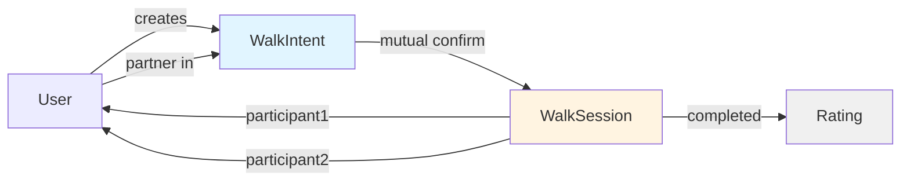
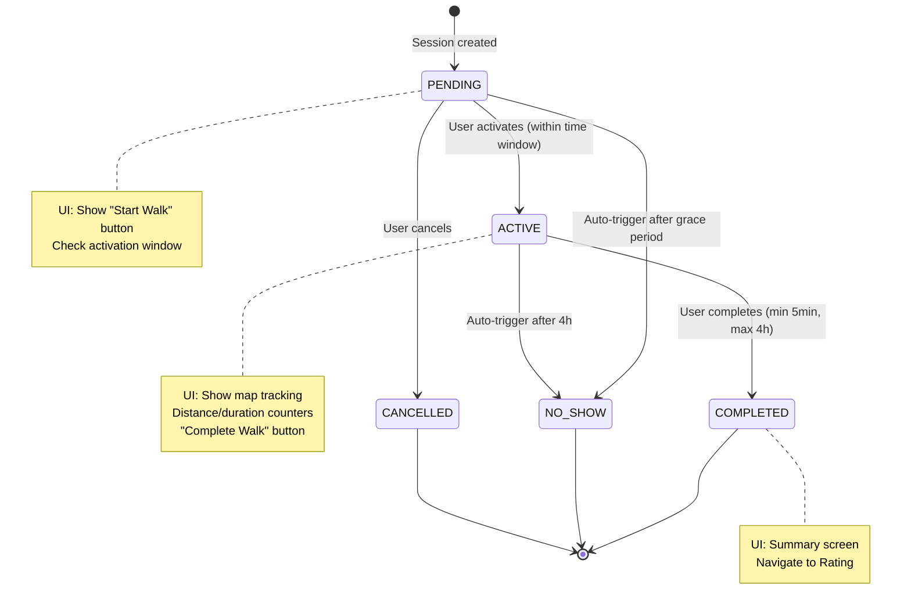
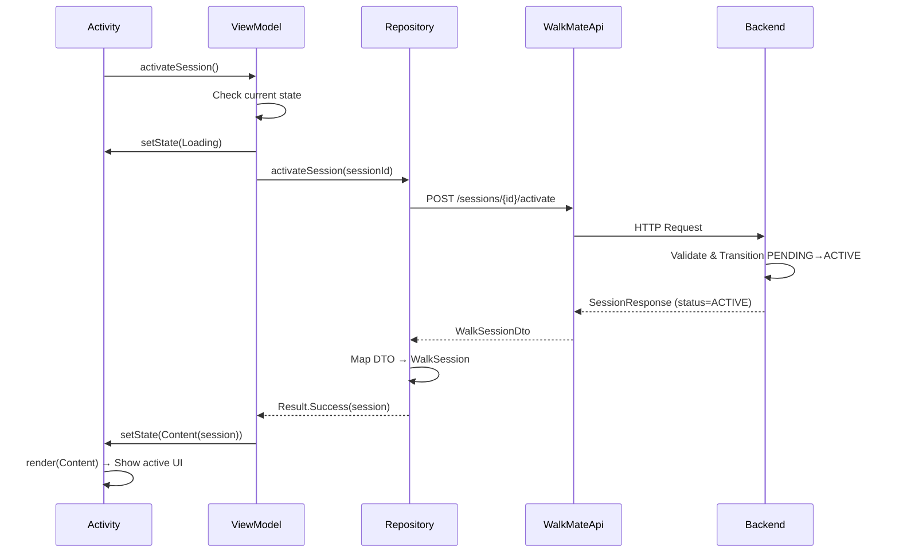

# WalkMate Frontend Domain Model (Lightweight)

**Platform:** Android Native (Java)  
**Core Models:** WalkIntent, WalkSession, SessionStatus  
**Date:** March 6, 2026

---

## 1. Domain Models

Frontend có **5 domain models chính**:

### 1.1 WalkIntent

```java
public class WalkIntent {
    private UUID id;
    private UUID creator;
    private UUID partner;  // nullable nếu chưa match

    private LocalDateTime scheduledTime;
    private Duration duration;
    private Location meetingPoint;

    private IntentStatus status; // OPEN, MATCHED, CONFIRMED, USED

    private boolean creatorConfirmed;
    private boolean partnerConfirmed;

    // Constructor, getters
}
```

---

### 1.2 WalkSession

```java
public class WalkSession {
    private UUID id;

    private SessionStatus status; // PENDING, ACTIVE, COMPLETED, NO_SHOW, CANCELLED

    private UUID participant1;
    private UUID participant2;

    private LocalDateTime scheduledStartTime;
    private LocalDateTime scheduledEndTime;

    private LocalDateTime actualStartTime;  // nullable nếu chưa activate
    private LocalDateTime actualEndTime;    // nullable nếu chưa complete

    // Constructor, getters
}
```

---

### 1.3 SessionStatus (Enum)

```java
public enum SessionStatus {
    PENDING,    // Chưa bắt đầu, chờ activate
    ACTIVE,     // Đang đi
    COMPLETED,  // Hoàn thành thành công
    NO_SHOW,    // Không ai activate / báo no-show
    CANCELLED   // Huỷ trước khi bắt đầu
}
```

**Key Rule:** Frontend **chỉ đọc** status từ backend. Không tự chuyển status.

---

### 1.4 Location (Value Object)

```java
public class Location {
    private double latitude;
    private double longitude;
    private String address; // Human-readable (optional)

    public Location(double lat, double lon, String address) {
        this.latitude = lat;
        this.longitude = lon;
        this.address = address;
    }

    // Getters
}
```

---

### 1.5 Distance (Value Object)

```java
public class Distance {
    private double meters;

    public Distance(double meters) {
        this.meters = meters;
    }

    public double kilometers() {
        return meters / 1000.0;
    }

    public String toDisplayString() {
        return String.format("%.2f km", kilometers());
    }
}
```

---

## 2. DTO vs Domain Mapping

### 2.1 DTO (từ API)

```java
// WalkSessionDto.java (trong data/model/)
public class WalkSessionDto {
    private String id;                    // String từ API
    private String status;                // String: "PENDING", "ACTIVE"...
    private String participant1;
    private String participant2;
    private String scheduledStartTime;    // ISO-8601 string
    private String scheduledEndTime;
    private String actualStartTime;       // nullable
    private String actualEndTime;         // nullable

    // Getters/Setters cho Gson
}
```

---

### 2.2 Mapper (DTO → Domain)

```java
public class SessionMapper {

    public static WalkSession toDomain(WalkSessionDto dto) {
        return new WalkSession(
            UUID.fromString(dto.getId()),
            SessionStatus.valueOf(dto.getStatus()),
            UUID.fromString(dto.getParticipant1()),
            UUID.fromString(dto.getParticipant2()),
            parseDateTime(dto.getScheduledStartTime()),
            parseDateTime(dto.getScheduledEndTime()),
            parseNullableDateTime(dto.getActualStartTime()),
            parseNullableDateTime(dto.getActualEndTime())
        );
    }

    private static LocalDateTime parseDateTime(String iso8601) {
        return LocalDateTime.parse(iso8601, DateTimeFormatter.ISO_DATE_TIME);
    }

    private static LocalDateTime parseNullableDateTime(String iso8601) {
        return iso8601 != null ? parseDateTime(iso8601) : null;
    }
}
```

**Rule:**

- DTO chỉ dùng trong `data/` layer (Repository)
- Domain model dùng trong `domain/` và `ui/` layer
- Activity/ViewModel **không** thấy DTO

---

## 3. UI Screens & UiState

### 3.1 Intent Screen

**UiState:**

```java
public abstract class IntentUiState {

    public static class Idle extends IntentUiState {}

    public static class Loading extends IntentUiState {}

    public static class Content extends IntentUiState {
        public final WalkIntent intent;
        public Content(WalkIntent intent) { this.intent = intent; }
    }

    public static class Error extends IntentUiState {
        public final String message;
        public Error(String message) { this.message = message; }
    }
}
```

**Usage trong ViewModel:**

```java
public class IntentViewModel extends ViewModel {

    private MutableLiveData<IntentUiState> uiState = new MutableLiveData<>(new IntentUiState.Idle());

    public void createIntent(LocalDateTime time, Location location) {
        uiState.setValue(new IntentUiState.Loading());

        intentRepository.createIntent(time, location, result -> {
            if (result instanceof Result.Success) {
                uiState.setValue(new IntentUiState.Content(result.data));
            } else {
                uiState.setValue(new IntentUiState.Error(result.error.getMessage()));
            }
        });
    }
}
```

---

### 3.2 Session Screen

**UiState:**

```java
public abstract class SessionUiState {

    public static class Idle extends SessionUiState {}

    public static class Loading extends SessionUiState {}

    public static class Content extends SessionUiState {
        public final WalkSession session;
        public Content(WalkSession session) { this.session = session; }
    }

    public static class Error extends SessionUiState {
        public final String message;
        public Error(String message) { this.message = message; }
    }
}
```

**Rendering dựa trên backend status:**

```java
// SessionActivity
private void render(SessionUiState state) {
    if (state instanceof SessionUiState.Content) {
        WalkSession session = ((SessionUiState.Content) state).session;
        renderSession(session);
    }
}

private void renderSession(WalkSession session) {
    // Hiển thị UI dựa trên backend status
    switch (session.getStatus()) {
        case PENDING:
            binding.tvStatus.setText("Chờ bắt đầu");
            binding.btnStartWalk.setVisibility(View.VISIBLE);
            binding.btnComplete.setVisibility(View.GONE);
            binding.activeWalkPanel.setVisibility(View.GONE);
            break;

        case ACTIVE:
            binding.tvStatus.setText("Đang đi bộ");
            binding.btnStartWalk.setVisibility(View.GONE);
            binding.btnComplete.setVisibility(View.VISIBLE);
            binding.activeWalkPanel.setVisibility(View.VISIBLE);
            startLocationTracking();
            break;

        case COMPLETED:
            binding.tvStatus.setText("Hoàn thành");
            showCompletionSummary(session);
            navigateToRating();
            break;

        case NO_SHOW:
            binding.tvStatus.setText("Không tham gia");
            showNoShowMessage();
            break;

        case CANCELLED:
            binding.tvStatus.setText("Đã huỷ");
            showCancelledMessage();
            break;
    }
}
```

---

### 3.3 Rating Screen

**UiState:**

```java
public abstract class RatingUiState {

    public static class Idle extends RatingUiState {}

    public static class Loading extends RatingUiState {}

    public static class Content extends RatingUiState {
        public final boolean submitted;
        public Content(boolean submitted) { this.submitted = submitted; }
    }

    public static class Error extends RatingUiState {
        public final String message;
        public Error(String message) { this.message = message; }
    }
}
```

---

## 4. Entity Relationship Diagram



**Notes:**

- **User** — managed by Supabase Auth (frontend chỉ lưu userId UUID)
- **WalkIntent** — coordination phase (reversible)
- **WalkSession** — lifecycle phase (irreversible after PENDING)
- **Rating** — triggered after COMPLETED

---

## 5. Session Status Mapping (Backend → UI)



### Status → UI Mapping Table

| Backend Status | UI Display (Vietnamese) | Button Visible  | Action Available   |
| -------------- | ----------------------- | --------------- | ------------------ |
| PENDING        | "Chờ bắt đầu"           | "Bắt đầu đi bộ" | activate()         |
| ACTIVE         | "Đang đi bộ"            | "Hoàn thành"    | complete()         |
| COMPLETED      | "Hoàn thành"            | —               | Navigate to Rating |
| NO_SHOW        | "Không tham gia"        | —               | Navigate back      |
| CANCELLED      | "Đã huỷ"                | —               | Navigate back      |

**Error States (API failures):**

| HTTP Status | Error Code               | UI Display                                   | Action    |
| ----------- | ------------------------ | -------------------------------------------- | --------- |
| 400         | OUTSIDE_TIME_WINDOW      | "Chưa đến thời gian bắt đầu"                 | Show info |
| 403         | UNAUTHORIZED_ACTION      | "Bạn không có quyền thực hiện hành động này" | —         |
| 404         | SESSION_NOT_FOUND        | "Không tìm thấy phiên đi bộ"                 | Retry     |
| 409         | INVALID_STATE_TRANSITION | "Không thể thực hiện hành động này"          | Reload    |
| 500         | SERVER_ERROR             | "Lỗi hệ thống, vui lòng thử lại"             | Retry     |

---

## 6. Data Flow Diagram



---

## 7. Validation Rules (Frontend)

### 7.1 Input Validation (Before API call)

```java
// IntentViewModel
public void createIntent(LocalDateTime time, Location location) {
    // Validate: time must be in future
    if (time.isBefore(LocalDateTime.now())) {
        uiState.setValue(new IntentUiState.Error("Thời gian phải trong tương lai"));
        return;
    }

    // Validate: location required
    if (location == null) {
        uiState.setValue(new IntentUiState.Error("Vui lòng chọn địa điểm"));
        return;
    }

    // Proceed with API call
    uiState.setValue(new IntentUiState.Loading());
    intentRepository.createIntent(time, location, this::handleResult);
}
```

---

### 7.2 Business Validation (Backend enforces, frontend displays)

```java
// SessionViewModel
public void activateSession() {
    SessionUiState current = uiState.getValue();
    if (!(current instanceof SessionUiState.Content)) return;

    WalkSession session = ((SessionUiState.Content) current).session;

    // Guard: must be PENDING
    if (session.getStatus() != SessionStatus.PENDING) {
        uiState.setValue(new SessionUiState.Error("Chỉ có thể bắt đầu từ trạng thái Chờ"));
        return;
    }

    // Guard: within activation window (-15min to +30min)
    LocalDateTime now = LocalDateTime.now();
    LocalDateTime earliest = session.getScheduledStartTime().minusMinutes(15);
    LocalDateTime latest = session.getScheduledStartTime().plusMinutes(30);

    if (now.isBefore(earliest)) {
        uiState.setValue(new SessionUiState.Error("Chưa đến thời gian bắt đầu"));
        return;
    }
    if (now.isAfter(latest)) {
        uiState.setValue(new SessionUiState.Error("Đã quá thời gian bắt đầu"));
        return;
    }

    // Proceed with API call
    uiState.setValue(new SessionUiState.Loading());
    sessionRepository.activateSession(session.getId(), this::handleResult);
}
```

**Note:** Frontend validation chỉ để **immediate feedback**. Backend vẫn validate lại (source of truth).

---

## 8. Summary

### Core Domain Models

| Model         | Purpose            | Fields                                     |
| ------------- | ------------------ | ------------------------------------------ |
| WalkIntent    | Coordination phase | creator, partner, time, location, status   |
| WalkSession   | Lifecycle phase    | id, status, participants, times            |
| SessionStatus | Enum               | PENDING/ACTIVE/COMPLETED/NO_SHOW/CANCELLED |
| Location      | Value object       | lat, lng, address                          |
| Distance      | Value object       | meters → km conversion                     |

### Mapping Flow

```
API Response (JSON)
    ↓
WalkSessionDto (data/model)
    ↓ [SessionMapper]
WalkSession (domain/model)
    ↓
SessionUiState.Content (ui/)
    ↓
Activity.render()
```

### Key Rules

1. **DTO ≠ Domain** — DTO chỉ trong data layer, Domain dùng trong ui + domain
2. **Backend status = source of truth** — Frontend chỉ hiển thị, không tự chuyển
3. **4 UiStates per screen** — Idle, Loading, Content, Error
4. **Validation 2 tầng** — Frontend (immediate feedback) + Backend (enforcement)
5. **Minimal models** — Chỉ 5 models chính, không phức tạp hoá

---

**END OF DOCUMENT**
