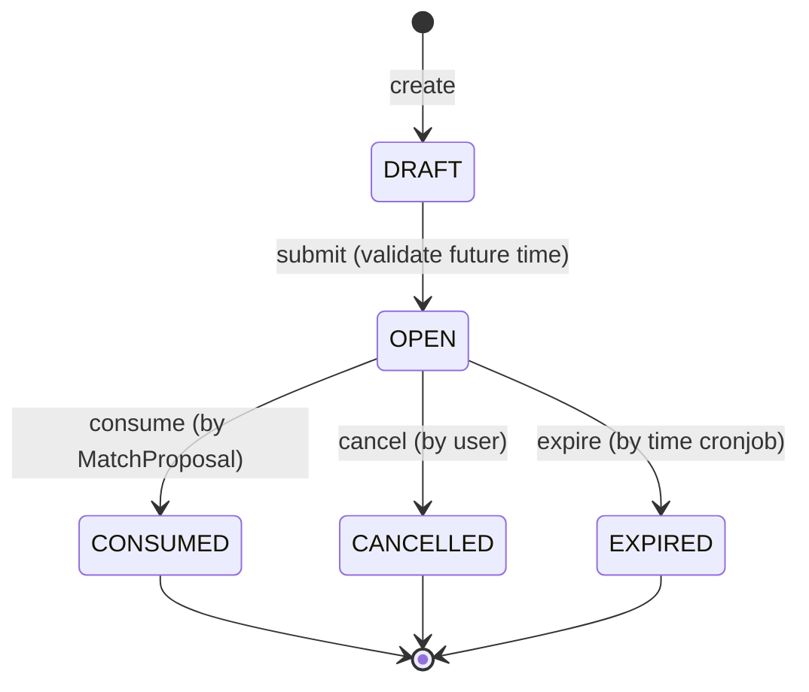

# Phân tích Domain, Lifecycle và Stress Test cho Walk Intent

Tài liệu này áp dụng quy trình phân tích từ `2-domain-lifecycle-statemachine-invariants-stresstest.workflow.md` dành riêng cho domain **Walk Intent**, dựa trên chuẩn SSOT (không bao gồm Match Proposal và Walk Session).

## 1. Xác định Domain (Domain Model)

**Mục tiêu:** WalkIntent quản lý cái gì?
WalkIntent là một yêu cầu tìm kiếm bạn đi bộ của user tại một thời điểm, địa điểm cụ thể với các tiêu chí nhất định (khoảng cách, loại hình...). Nó đại diện cho "sự khả dụng" (availability) của user.

**Domain Objects:**
*   **WalkIntent (Aggregate Root)**: Chứa toàn bộ thông tin về yêu cầu tìm kiếm.
*   **Location Snapshot (Value Object)**: Tọa độ điểm bắt đầu.
*   **Time Window (Value Object)**: Khung thời gian khả dụng (`time_window_start`, `time_window_end`).
*   **Matching Constraints (Value Object)**: Bán kính, giới tính, tuổi, loại hình đi bộ...

---

## 2. Xác định Lifecycle

Vòng đời của một `WalkIntent` từ lúc tạo nháp đến khi kết thúc:

*   **DRAFT**: Trạng thái sơ khởi, đang cấu hình, chưa được đưa vào hệ thống matching.
*   **OPEN**: Yêu cầu đã hợp lệ, đang mở để chờ hệ thống tìm kiếm người phù hợp. Bắt đầu block các khoảng thời gian trùng lặp.
*   **CONSUMED**: Đã được sử dụng để tạo thành công một chuyến đi. Không còn block thời gian nữa.
*   **CANCELLED**: Người dùng chủ động rút lại yêu cầu trước khi nó được ghép cặp thành công.
*   **EXPIRED**: Khung thời gian dự kiến đã trôi qua mà không được ghép cặp thành công.

---

## 3. Xây dựng State Machine

**States:** `DRAFT`, `OPEN`, `CONSUMED`, `CANCELLED`, `EXPIRED`.

**Transitions (Hành động chuyển trạng thái):**
*   `submitIntent()`: DRAFT -> OPEN (User xác nhận tạo, system validate thời gian hợp lệ).
*   `consumeIntent()`: OPEN -> CONSUMED (Được trigger bởi hệ thống khi một Proposal liên quan chuyển sang CONFIRMED).
*   `cancelIntent()`: OPEN -> CANCELLED (User chủ động hủy).
*   `expireIntent()`: OPEN -> EXPIRED (Hệ thống tự động chạy cronjob khóa và hủy các intent quá hạn).

**State Machine Diagram:**

---

## 4. Xác định Invariants (Quy tắc bất biến)

Dựa trên tài liệu SSOT, các invariant bắt buộc phải tuân thủ nghiêm ngặt ở cấp độ Database và Application:

*   **I-1 (No Overlapping OPEN Intents):** Một user không được phép có nhiều WalkIntent ở trạng thái `OPEN` mà có khoảng thời gian (`time window`) giao nhau. Phải xử lý triệt để bằng GiST exclusion constraint trong DB, không tin tưởng code application để chống concurrent inserts.
*   **I-3 (Consume is Exclusive):** Một WalkIntent chỉ chuyển từ `OPEN` sang `CONSUMED` duy nhất một lần. Không bao giờ được phép mở lại (reopen) một Intent đã CONSUMED để tham gia vào ghép cặp khác.
*   **I-5 (Terminal State Immutability):** Các trạng thái `CONSUMED`, `CANCELLED`, và `EXPIRED` là trạng thái cuối (terminal). Tuyệt đối không có hành động nào được phép mutate (thay đổi) các trạng thái này sau khi đã thiết lập.
*   **I-6 (Draft Transition Guardrail):** DRAFT chỉ được lên OPEN nếu `time_window_start` nằm ở tương lai trừ đi một buffer time cho phép (đảm bảo tính hợp lý thực tiễn).
*   **I-7 (Expiry Lock Safety):** Khi Cronjob quét và chuyển intent từ `OPEN` sang `EXPIRED`, bắt buộc phải dùng `SELECT ... FOR UPDATE SKIP LOCKED` để tránh race condition với các thao tác ghép cặp/confirm đang diễn ra cùng thời điểm.
*   *(Note: Sức mạnh của WalkIntent là phát ra event khi chuyển EXPIRED/CANCELLED, hệ thống bên ngoài lắng nghe Event để phản ứng, bản thân WalkIntent không gọi module khác trực tiếp).*

---

## 5. Stress Test Design (Tấn công thiết kế)

Các kịch bản cần test để đảm bảo State Machine và Invariants không bị phá vỡ:

### 1. Concurrency (Race Conditions)
*   **Tạo đúp Intent (Bypass I-1):** Cùng lúc gửi 5 request tạo WalkIntent `OPEN` cho cùng một khoảng thời gian.
    *   *Kỳ vọng:* Chỉ 1 request thành công, 4 request còn lại bị Database (GiST constraint) đá văng.
*   **Expire vs Consume (Bypass I-7):** Cronjob `expireIntent()` chạy đúng vào tích tắc milliseconds mà một MatchProposal đang cố gắng `consumeIntent()`.
    *   *Kỳ vọng:* Row lock (`FOR UPDATE`) giúp serialize 2 transaction này. Nếu Consume lấy lock trước, Expire đọc ra status CONSUMED và bỏ qua. Nếu Expire lấy rước, Consume đọc ra EXPIRED và abort việc tạo session bên kia.

### 2. State Mutation
*   **Hồi sinh zombie (Bypass I-5, I-3):** Thử gọi API sửa record hoặc tạo luồng ép một Intent đang `CANCELLED` hoặc `CONSUMED` trở về `OPEN`.
    *   *Kỳ vọng:* Logic domain ném lỗi `IllegalStateException`, không cho phép update.
*   **Dupe consume (Bypass I-3):** Giả lập hệ thống queue xử lý event Confirm 2 lần, gọi lệnh `consumeIntent()` 2 lần lên trên cùng 1 record.
    *   *Kỳ vọng:* Lần 1 thành công (OPEN -> CONSUMED). Lần 2 throw lỗi vì trạng thái hiện hành không phải OPEN, đảm bảo tính Idempotent.

### 3. Distributed/Delay
*   **Tạo Intent trễ (Bypass I-6):** Thử gửi gói tin create Intent (DRAFT -> OPEN) với `time_window_start` lúc 7h00 trong khi server time đang là 7h05.
    *   *Kỳ vọng:* Giao dịch bị Block ở Domain Validation vì điểm neo thời gian trong tương lai phải hợp lệ.

---
**Tổng kết:** WalkIntent đóng vai trò là "Availability Record" gốc. Việc bảo vệ nghiêm ngặt I-1 và I-7 bằng Database Lock là sống còn để chống trùng lịch và lỗi state race condition trong hệ thống ghép cặp realtime.
