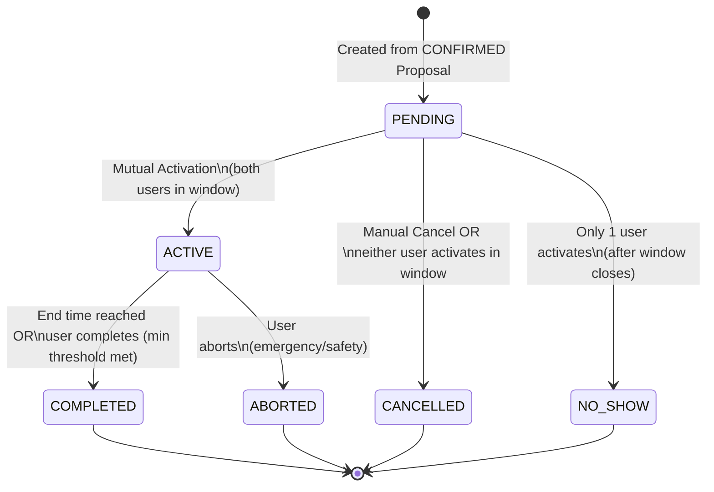

# Phân tích Domain → Lifecycle → State Machine → Invariants → Stress Test: Walk Session

Tài liệu này áp dụng quy trình tư duy 5 bước từ file `2-domain-lifecycle-statemachine-invariants-stresstest.workflow.md` để phân tích chuyên sâu domain **Walk Session**, dựa vào Core Single Source of Truth của hệ thống.

---

## 1️⃣ Xác định Domain

**Câu hỏi:** Hệ thống đang quản lý cái gì ở Walk Session?
**Trả lời:** Domain WalkSession quản lý **sự thực thi trong đời thực** của một cuộc hẹn đi bộ và **ghi nhận giá trị cuối cùng** của chuyến đi đó.

### Thể hiện (Domain Model):
*   **WalkSession (Aggregate Root):** Lớp bảo vệ bao trùm, đại diện cho toàn bộ thông tin của chuyến đi bộ (trạng thái, thời gian bắt đầu thực tế, thời gian kết thúc, lý do hủy nếu có).
*   **Participants (Value Object / Reference):** 2 User ID tham gia vào chuyến đi (Distinct Users - quy tắc `X-3`).
*   **TimeWindow (Value Object):** Khung thời gian lịch trình ban đầu được kế thừa từ 2 Intent (`X-2`).
*   **Activation Properties:** Lưu vết thời điểm Check-in (Activate) của từng cá nhân.
*   **Tracking Stats (Value Object):** Metrics về chuyến đi như số bước chân, quãng đường, thời lượng thực tế (cấp nhật khi End session).

---

## 2️⃣ Xác định Lifecycle

Câu hỏi: Vòng đời của WalkSession diễn ra như thế nào?

*   **Khởi tạo (`PENDING`):** Được sinh ra tự động & duy nhất khi 1 `MatchProposal` chuyển sang `CONFIRMED`. Đang chờ 2 user bấm "Start / Check-in" (Activate) trong activation window.
*   **Hoạt động (`ACTIVE`):** Khi cả 2 user đã bắt đầu đi.
*   **Kết thúc (Các trạng thái Terminal):**
    *   **`COMPLETED`:** Khi chuyến đi hoàn thành tốt đẹp đủ thời gian.
    *   **`CANCELLED`:** Khi có người hủy chuyến trước/trong giờ hẹn, hoặc cả hai tàng hình (không ai đến).
    *   **`NO_SHOW`:** Khi chỉ có 1 người xuất hiện và bấm Start, người kia không tới khi hết giờ.
    *   **`ABORTED`:** Bị hủy sự cố giữa chừng do khẩn cấp/an toàn (khi đang ACTIVE).

---

## 3️⃣ Xây dựng State Machine

State Machine formalize lại các bước chuyển đổi, cấm hoàn toàn cập nhật trạng thái tùy tiện.

### Danh sách trạng thái
- Non-terminal (Có thể đổi): `PENDING`, `ACTIVE`
- Terminal (Bất biến - `S-8`): `COMPLETED`, `NO_SHOW`, `CANCELLED`, `ABORTED`

### Chuyển đổi trạng thái (Transitions)

---

## 4️⃣ Xác định Invariants (Hợp đồng Domain)

Dựa vào file Invariants SSOT, WalkSession phải tuân thủ nghiêm ngặt các quy tắc:

*   **[S-1] Tính hợp lệ khi tạo:** Phải sinh ra độc quyền từ 1 `CONFIRMED` MatchProposal và 2 Intents gốc đang ở trạng thái `OPEN`.
*   **[S-2] Ngăn chặn Overlap:** 1 User cấm có nhiều hơn 1 WalkSession (dù là `PENDING` hay `ACTIVE`) trùng lấp khung thời gian. Phải chặn ở mức Database.
*   **[S-3 + S-4] Điều kiện kích hoạt:** Chỉ lên `ACTIVE` khi cả 2 activate. Và việc activate bị cấm cửa ngoặt thời gian `[confirmedStartTime - earlyGrace, confirmedStartTime + lateGrace]`.
*   **[S-5 + S-6] Xử lý vắng mặt (Cron / System):** Hết hạn window: Có 1 người activate -> `NO_SHOW`. Có 0 người activate -> `CANCELLED`. Việc đánh giá đổi rule S-5 phải có Concurrency Lock chống race condition.
*   **[S-7] Hoàn thành hợp lệ:** Cấm user tự tiện bấm "End" (để lấy điểm) nếu thời gian đi thực tế nhỏ hơn con số tối thiểu (ví dụ < 5 phút).
*   **[S-8] Tính bất biến Terminals:** Đã vào `COMPLETED`, `NO_SHOW`, `CANCELLED`, `ABORTED` thì mọi hành vi UPDATE state là bất hợp pháp.
*   **[S-9] Quản lý rác (Zombie fix):** `ACTIVE` quá giới hạn hệ thống (vd: 4 tiếng) sẽ phải bị auto-complete.

---

## 5️⃣ Stress Test Design

Thiết kế sẽ ra sao khi bị "tấn công" bởi traffic thực tế?

### 1. Concurrency & Race Conditions
*   **Tình huống:** User A bấm "Activate" lúc 08:15:00.000 trùng chính xác vào mili-giây mà Cron Job hệ thống đóng Activation Window chạy trigger khóa lịch để phạt `NO_SHOW`.
*   **Thiết kế bảo vệ:** Tuân thủ `S-5`. Lệnh expire của Cronjob phải sử dụng `SELECT ... FOR UPDATE` row-level lock. Nếu HTTP request của user giành được kết nối trước, Cron sẽ đợi. Sau khi User xong chuyển state, Cron chạy tiếp nhưng thấy logic đã thay đổi -> bỏ qua mà không làm hỏng dữ liệu.

### 2. Sự cố ghi đè State (State Mutation Race)
*   **Tình huống:** User A bấm "Cancel" trên xe bus. User B đang đợi bèn bấm "Activate" ở app. Hai API chọc tới server cùng 1 mili-giây trên trạng thái `PENDING`.
*   **Thiết kế bảo vệ:** Cần giải pháp **Optimistic Locking** (cột `version` trong DB). Nếu Cancel vào trước cập nhật `version = 2`, lệnh Activate sau ghi đè sẽ thất bại vì version lúc query là 1. Hệ thống throw `InvalidStateTransitionException` ở tầng Domain báo cho User B là "Trạng thái này đã khép lại".

### 3. Distributed System Failure (Partial Failure)
*   **Tình huống:** WalkSession của 2 người chuyển `ACTIVE` thành công. Lúc này theo business cần bắn Push Notification "Bạn đi thôi" cho User kia. Nhưng server Firebase/FCM sập timeout 10 giây.
*   **Thiết kế bảo vệ:** Eventual Consistency bằng **Outbox Pattern**. Trong Transaction DB đổi `PENDING` -> `ACTIVE`, nhét thêm record event `SessionActivatedEvent` vào bảng `outbox`. Commit. API trả ngay HTTP 200 cho user. Một worker chạy ngầm sẽ đọc outbox đó để bắn Notification retry cho tới khi Firebase sống lại. Tuyệt đối không để rớt mạng Notification làm rollback transaction DB của Session.

### 4. Idempotency (Lặp lệnh giả mạo/Rớt mạng)
*   **Tình huống:** User bấm "Complete Session" khi đã đi bộ xong, đi qua vùng mất sóng 4G, app auto retry gọi API 3 lần.
*   **Thiết kế bảo vệ:** Domain logic kiểm tra nếu session đã ở trạng thái `COMPLETED` thì 2 lệnh retry kia phải được **Ignore hợp lệ (Idempotent)** và trả về code HTTP 200 (Success) như bình thường để dọn dẹp App UI. Đặc biệt, logic trao cúp/thưởng calo nằm chung Aggregate xử lý ở phát hit đầu tiên, 2 hit sau không được thưởng đúp.
