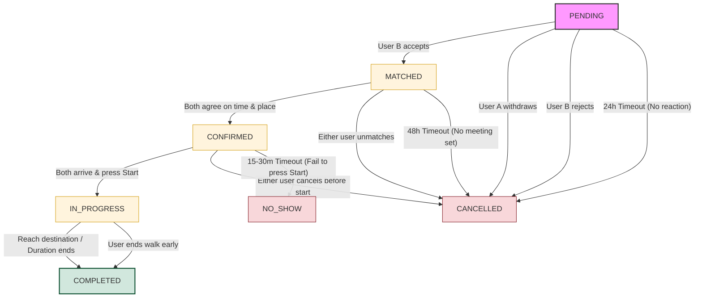
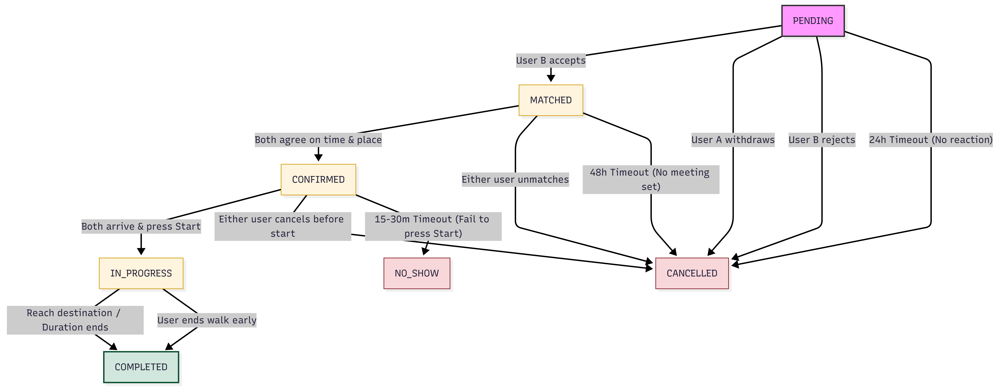

# Weekly Report – Group 09

---

## General Information

| Field            | Value                   |
| ---------------- | ----------------------- |
| **Group ID**     | Group 09                |
| **Project Name** | WalkMate                |
| **Date Range**   | 2026-02-23 – 2026-03-04 |

---

## Tasks Completed This Week

### 23127179 – Nguyễn Bảo Duy

- Task 1 description
- **Evidence:** _(Jira screenshot link / output document / artifact)_

### 23127006 – Trần Nguyễn Khải Luân

- Task 1 description
- **Evidence:** _(Jira screenshot link / output document / artifact)_

### 23127438 – Đặng Trường Nguyên

1. ## Definition

- **PENDING:** A match request has been sent and is currently waiting for the other person to accept or decline.
- **MATCHED:** Both users have "swiped right" or mutually agreed to connect and can now start chatting.
- **CONFIRMED:** Both parties have officially agreed on a specific time and meeting point for their walk.
- **IN_PROGRESS:** The walking session is currently active; the app may be tracking real-time GPS or duration.
- **COMPLETED:** The walking session has successfully finished according to the planned route or time.
- **CANCELLED:** The scheduled walk was called off by either user (or the system) before it actually started.
- **NO_SHOW:** A user confirmed the appointment but failed to appear at the meeting location as promised.

2. ## State Transition

- The following **State Transition** model outlines the logical flow of a walking session, defining how the system moves from one status to another based on user actions and predefined system triggers.

### State Transition Table:

| Current State | Next State  | Trigger                            | Who         | Timeout                    |
| :-----------: | :---------: | ---------------------------------- | ----------- | -------------------------- |
|    PENDING    |   MATCHED   | User B accepts                     | User B      | 24h (User B doesn’t react) |
|    PENDING    |  CANCELLED  | User A withdraws request           | User A      | \-                         |
|    PENDING    |  CANCELLED  | User B rejects                     | User B      | \-                         |
|    MATCHED    |  CONFIRMED  | Both users agree on time and place | Both users  | 48h (No meeting set)       |
|    MATCHED    |  CANCELLED  | Either user unmatches              | Either user | \-                         |
|   CONFIRMED   | IN_PROGRESS | Both user arrive and press “Start” | Both users  | 15 min (After start time)  |
|   CONFIRMED   |  CANCELLED  | Either user cancels before start   | Either user | \-                         |
|   CONFIRMED   |   NO_SHOW   | One or both fail to press “Start”  | System      | 15-30 min                  |
|  IN_PROGRESS  |  COMPLETED  | Reach destination or duration ends | System/User | \-                         |
|  IN_PROGRESS  |  COMPLETED  | User end walk early                | Either user | \-                         |

### State Transition Flow:

- Mermaid code:

- Result with [https://mermaid.ai](https://mermaid.ai):

3. ## Timeout Rules

- The **Timeout Rules** define the automated system triggers designed to maintain a clean and active database by expiring stagnant requests or inactive sessions across different states.

### Timeout rule table:

| Current State |       Timeout        | Trigger by | Next State | Description                                                                     |
| :-----------: | :------------------: | :--------: | :--------: | ------------------------------------------------------------------------------- |
|    PENDING    |       24 Hours       |   System   | CANCELLED  | The request was not accepted or declined by the recipient within 1 day.         |
|    MATCHED    |       48 Hours       |   System   | CANCELLED  | Users matched but failed to confirm a meeting time/place within 2 days.         |
|   CONFIRMED   | 15 Mins (Post-start) |   System   |  NO_SHOW   | User A pressed "Start" but User B did not show up/press "Start" within 15 mins. |
|   CONFIRMED   | 15 Mins (Post-start) |   System   | CANCELLED  | Neither user arrived or pressed "Start" within the 15-minute grace period.      |
|  IN_PROGRESS  |       4 Hours        |   System   | COMPLETED  | The session was left running too long; the system auto-closes it.               |

### Specification:

1. Case PENDING → CANCELLED:

- Purpose:
  - Prevents unresponsive requests from accumulating and cluttering the sender’s outgoing queue.
  - Ensures the system remains clean and avoids long-lived inactive states.
- Logic:
  - State \= PENDING
  - Condition: User B does not respond within 24 hours
  - Trigger: System scheduler checks expiration timestamp
  - Transition: PENDING → CANCELLED
- Action:
  - Notify the sender: "Your request to \[Name\] has expired due to no response."
  - Remove request from active list
  - No reliability penalty applied

2. Case MATCHED → CANCELLED:

- Purpose:
  - Encourages users to move beyond passive matching and commit to real-world interaction.
  - Prevents “match collecting” behavior.
- Logic:
  - State \= MATCHED
  - Condition: No meeting time and location set within 48 hours
  - Trigger: System scheduled timeout job
  - Transition: MATCHED → CANCELLED
- Additional engagement rule:
  - At the 24h mark (if still MATCHED and not CONFIRMED), send reminder notification.
- Action:
  - At 24h: Send a nudge: "Don't keep them waiting\! Set a walking schedule now."
  - At 48h: Archive that, Notify both users: "This match has expired due to inactivity."
  - No reliability penalty applied

3. Case CONFIRMED → NO_SHOW:

- Purpose:
  - Protects committed users from being stood up.
  - Maintains accountability and trust within the community.
- Logic:
  - State \= CONFIRMED
  - Condition:
    - Scheduled start time has passed
    - Current time ≥ Start_Time \+ 15 minutes (grace period) AND
    - Exactly one user pressed “Start” or checked-in
  - Trigger: System time-based validation
  - Transition: CONFIRMED → NO_SHOW
- Action:
  - Mark absent user as NO_SHOW
  - Apply reliability penalty:
    - Deduct 10–20 reliability points (or \-0.1 normalized score)
  - Notify both users:
    - To the present user: "Your partner did not show up. This session has been marked as No-Show."
    - To the absent user: "You missed your scheduled walk. A reliability penalty has been applied."

4. #### Case CONFIRMED → CANCELLED:

- Purpose:
  - Handles cases where both users fail to initiate the walk.
  - Avoids unfair penalties when mutual absence is likely.
- Logic:
  - State \= CONFIRMED
  - Condition:
    - Current time ≥ Start_Time \+ 15 minutes
    - AND count(Start_Pressed) \== 0
  - Trigger: System time-based validation
  - Transition: CONFIRMED → CANCELLED
- Action:
  - Mark session as CANCELLED
  - No penalties are applied as it is assumed both parties forgot or mutually agreed to cancel offline.
  - Notify both users: "Your scheduled walk was automatically cancelled due to inactivity."

5. #### Case IN_PROGRESS → COMPLETED:

- Purpose:
  - Ensures sessions are eventually finalized.
  - Prevents sessions from being stuck indefinitely due to app crashes, background mode, or user forgetfulness.
- Logic:
  - State \= IN_PROGRESS
  - Condition:
    - Walk duration reached OR
    - Destination reached OR
    - Both users press "End Walk"
  - Trigger: System or user action
  - Transition: IN_PROGRESS → COMPLETED
  - Safety-net auto completion:
    - If session remains IN_PROGRESS for \> 4 hours
    - System auto-marks as COMPLETED based on last known GPS coordinate
- Action:
  - Mark session as COMPLETED
  - Update reliability positively (+ small increment)
  - Enable post-walk feedback screen
  - Store final GPS and duration summary

4. ## Cancellation Rules

- This section outlines the **Cancellation Policy**, including the specific conditions, timing thresholds, and associated penalties for withdrawing from a connection or a confirmed walking session.

### Cancellation rule table:

| Current State | Timing of Cancellation |            Penalty/Action             |   Reason Code   |                 Notification to other user                 |
| :-----------: | :--------------------: | :-----------------------------------: | :-------------: | :--------------------------------------------------------: |
|    PENDING    |        Anytime         |              No penalty               |  USER_WITHDRAW  |                      No notification                       |
|    MATCHED    |        Anytime         |              No penalty               |  USER_UNMATCH   |             “Your match has been disconnected”             |
|   CONFIRMED   | \> 2 hours before walk |              No penalty               |  EARLY_CANCEL   | “\[Name\] cancelled the walk\! You can find a new partner” |
|   CONFIRMED   | \< 2 hours before walk | Minor penalty (-5 Reliability Score)  |   LATE_CANCEL   | “\[Name\] cancelled the walk\! You can find a new partner” |
|   CONFIRMED   | \< 15 mins before walk | Major penalty (-20 Reliability Score) | CRITICAL_CANCEL | “\[Name\] cancelled the walk\! You can find a new partner” |
|  IN_PROGRESS  |    During the walk     |              No penalty               |  EARLY_FINISH   |       “\[Name\] ended the walk early. Happy walking”       |

### Specification:

1. Case PENDING → CANCELLED:

- Purpose:
  - Allows users to freely retract a walk request before mutual interest is established.
  - Encourages low-friction interaction and reduces hesitation in initiating requests.
- Logic:
  - Current State \= PENDING
  - Trigger \= User A selects “Withdraw Request”
  - Timing \= Anytime before User B responds
  - Transition \= PENDING → CANCELLED
  - Reason Code \= USER_WITHDRAW
  - Penalty \= None
- Action:
  - Remove request from active queue
  - No reliability change
  - No notification sent to User B (as per your table)

2. Case MATCHED → CANCELLED:

- Purpose:
  - Allows users to disengage before a real-world commitment is made.
  - Prevents forced interactions when compatibility is reconsidered.
- Logic:
  - Current State \= MATCHED
  - Trigger \= Either user selects “Unmatch”
  - Timing \= Anytime before CONFIRMED
  - Transition \= MATCHED → CANCELLED
  - Reason Code \= USER_UNMATCH
  - Penalty \= None
- Action:
  - Disconnect chat
  - Notify other users: "Your match has been disconnected."
  - No reliability penalty applied

3. Case CONFIRMED → CANCELLED (\> 2 hours before walk \- Early Cancellation)

- Purpose:
  - Encourages responsible cancellation with sufficient notice.
  - Minimizes inconvenience to the other participant.
- Logic:
  - Current State \= CONFIRMED
  - Condition: Cancel time ≤ Start_Time − 2 hours
  - Trigger: Either user selects “Cancel Walk”
  - Transition: CONFIRMED → CANCELLED
  - Reason Code: EARLY_CANCEL
  - Penalty: None
- Action:
  - Notify other users: "\[Name\] cancelled the walk\! You can find a new partner."
  - No reliability deduction
  - Suggest rescheduling option

4. Case CONFIRMED → CANCELLED (\< 2 hours before walk \- Late Cancel)

- Purpose:
  - Discourages last-minute cancellations that negatively impact user experience.
  - Maintains fairness and reliability within the system.
- Logic:
  - Current State \= CONFIRMED
  - Condition: Start_Time − 2h \> Cancel_Time ≥ Start_Time − 15min
  - Trigger: Either user selects “Cancel Walk”
  - Transition: CONFIRMED → CANCELLED
  - Reason Code: LATE_CANCEL
  - Penalty: \-5 Reliability Score
- Action:
  - Deduct 5 reliability points from cancelling user
  - Notify other users: "\[Name\] cancelled the walk\! You can find a new partner."
  - Log penalty event

5. Case CONFIRMED → CANCELLED (\< 15 mins before walk \- Critical Cancel)

- Purpose:
  - Strongly discourages near-start-time cancellations, which closely resemble no-shows.
  - Protects committed users from high-impact inconvenience.
- Logic:
  - Current State \= CONFIRMED
  - Condition: Cancel_Time ≥ Start_Time − 15 minutes
  - Trigger: Either user selects “Cancel Walk”
  - Transition: CONFIRMED → CANCELLED
  - Reason Code: CRITICAL_CANCEL
  - Penalty: \-20 Reliability Score
- Action:
  - Deduct 20 reliability points
  - Notify other users: "\[Name\] cancelled the walk\! You can find a new partner."
  - Flag event for reliability tracking

6. Case CONFIRMED → COMPLETED (During the walk)

- Purpose:
  - Allows flexibility in ending a session earlier than planned.
  - Respects real-world constraints while preserving session validity.
- Logic:
  - Current State \= IN_PROGRESS
  - Trigger: Either user presses “End Walk”
  - Timing: During active session
  - Transition: IN_PROGRESS → COMPLETED
  - Reason Code: EARLY_FINISH
  - Penalty: None
- Action:
  - Mark session as COMPLETED
  - Notify other users: "\[Name\] ended the walk early. Happy walking\!"
  - Record final GPS and duration

5. ## NO_SHOW Logic

- This part is designed to identify and handle cases where users have committed to appointments but fail to show up, directly impacting community trust.

### Specification:

- Purpose: To identify and penalize users who commit to a walk but fail to appear without prior notification, thereby protecting the time and trust of the reliable community.
- Logic: The NO_SHOW state is triggered exclusively from the CONFIRMED state when the following criteria are met:
  - Time Threshold: The current time exceeds the Scheduled_Time by a grace period of 15 to 30 minutes.
  - Check-in Status: The system evaluates the "Start" button status for both participants.
  - Scenario A (One-Sided): User A has pressed "Start," but User B has not interacted with the app within the grace period.
  - Scenario B (Both Missing): Neither user has pressed "Start" by the end of the grace period (this may transition to CANCELLED with the reason BOTH_MISSING).
- Action: When a NO_SHOW is detected, the system executes the following automated tasks:
  - State Transition: The record status is updated from CONFIRMED to NO_SHOW.
  - Reason Logging: The transition is tagged with the reason code USER_MISSING.
  - Penalty Enforcement: A Major Penalty is applied to the offending user, typically resulting in a significant deduction from their Reliability Score (-25 Reliability Score).
  - Account flagging: The user's profile is flagged for "NO_SHOW" history, which may lead to temporary account restrictions if repeated.
  - For the "Waiting" User: An immediate notification is sent: "Sorry\! Your partner didn't show up. We've noted this on their profile. You can find a new partner now".
  - For the "No-Show" User: A warning is sent: "You missed your scheduled walk. Your Reliability Score has been penalized. Please cancel in advance next time to avoid account restrictions".

6. ## Reliability Scoring Logic

- This section is designed to reward consistent walkers and provide a clear visual indicator of a user's commitment level.

### Score Calculation:

- Every new user starts with a Base Score of 100\.
- Points are dynamically updated based on the Reason Codes from your transitions:

|               State               | Point Change | Reason Code Reference |
| :-------------------------------: | :----------: | :-------------------: |
|             COMPLETED             |     \+2      |    SUCCESS_FINISH     |
| CANCELLED (\>2 hours before walk) |      0       |     EARLY_CANCEL      |
| CANCELLED (\<2 hours before walk) |     \-5      |      LATE_CANCEL      |
| CANCELLED (\<15 mins before walk) |     \-20     |    CRITICAL_CANCEL    |
|              NO_SHOW              |     \-25     |     USER_MISSING      |

### Reliability Tiers:

- Tiers are displayed on the user's profile to help others decide whether to match during the PENDING phase.
  - **Elite (150+ Points):** Reserved for the most active and reliable walkers. Benefits include priority matching in the PENDING queue.
  - **Verified (100–149 Points):** The standard tier for dependable users. Shows a "Reliable" badge during the MATCHED state.
  - **Caution (50–99 Points):** Assigned after a LATE_CANCEL or a single NO_SHOW. Users at this tier may see fewer matches.
  - **Restricted (\< 50 Points):** Triggered by multiple NO_SHOW events. The account is limited to 1 match per day for 7 days to encourage better behavior.

### Specification:

- Purpose:
  - To create a self-regulating community where the Reliability Score acts as a "Trust Currency," ensuring that CONFIRMED walks actually result in an IN_PROGRESS session.
- Logic:
  - Users can get points by successfully reaching the COMPLETED state in walks (+2 per walk).
  - If a user remains in the MATCHED state without ever reaching CONFIRMED for 30 days, their score remains stagnant, encouraging them to actually schedule walks.
- Action:
  - The system recalculates the tier immediately after a state transitions to COMPLETED, CANCELLED (\<2 hours before walk) or NO_SHOW.
  - When a user drops a tier (e.g., from Verified to Caution), they receive a warning: "Your Reliability Tier has dropped due to a recent No-Show. Complete 5 walks to return to Verified status."

### 23127539 – Nguyễn Thanh Tiến
@import "database_design_report.md"

## AI Usage Declaration

### 23127179 – Nguyễn Bảo Duy

| #   | Tool & Version          | Access Time                | Prompt Used | Purpose                    | Content Generated      | Student Validation            |
| --- | ----------------------- | -------------------------- | ----------- | -------------------------- | ---------------------- | ----------------------------- |
| 1   | _(e.g., ChatGPT GPT-4)_ | _(e.g., 2026-03-03 14:00)_ | _"..."_     | _(e.g., assist section X)_ | _(describe AI output)_ | _(describe edits/validation)_ |

**Screenshots / Chat History:** _(attach files or paste links)_

### 23127006 – Trần Nguyễn Khải Luân

| #   | Tool & Version          | Access Time                | Prompt Used | Purpose                    | Content Generated      | Student Validation            |
| --- | ----------------------- | -------------------------- | ----------- | -------------------------- | ---------------------- | ----------------------------- |
| 1   | _(e.g., ChatGPT GPT-4)_ | _(e.g., 2026-03-03 14:00)_ | _"..."_     | _(e.g., assist section X)_ | _(describe AI output)_ | _(describe edits/validation)_ |

**Screenshots / Chat History:** _(attach files or paste links)_

### 23127438 – Đặng Trường Nguyên

| #   | Tool & Version          | Access Time                | Prompt Used | Purpose                    | Content Generated      | Student Validation            |
| --- | ----------------------- | -------------------------- | ----------- | -------------------------- | ---------------------- | ----------------------------- |
| 1   | _(e.g., ChatGPT GPT-4)_ | _(e.g., 2026-03-03 14:00)_ | _"..."_     | _(e.g., assist section X)_ | _(describe AI output)_ | _(describe edits/validation)_ |

**Screenshots / Chat History:** _(attach files or paste links)_

### 23127539 – Nguyễn Thanh Tiến

| # | Tool & Version | Access Time | Prompt Used | Purpose | Content Generated | Student Validation |
|---|---------------|-------------|-------------|---------|------------------|-------------------|
| 1 | Gemini Pro | 2026-03-02 | "Suggest necessary database tables for a walking companion matching system with authentication, location, AI matching, chat, scheduling, and review features." | Identify required database tables for the system | AI suggested several groups of tables for user management, matching, walking sessions, chat, reviews, AI data, and achievements. | Reviewed the suggestions and adapted them to design the final WalkMate database schema. |
| 2 | Gemini Pro | 2026-03-07 | "Suggest business rules for the walking companion matching system." | Identify possible business rules for the system | AI suggested rules such as: users must authenticate before matching, a walking session connects two users, chat rooms are created after a successful match, and reviews can only be submitted after a completed walk. | Selected relevant rules and refined them to fit the final system design. |
| 3 | Chat GPT (temporary) | 2026-03-07 | "Check grammar and improve the wording of the database design and system description." | Improve English grammar and clarity in the report | AI suggested corrections for grammar, sentence structure, and wording in several sections of the documentation. | Reviewed all suggestions and manually edited the text to ensure the meaning and technical accuracy were preserved. |

**Chat History:** [Gemini Conversation Log](https://gemini.google.com/share/391c439b0261)

---

## Tasks Planned for Next Week

- [ ] Task A – _(assignee)_
- [ ] Task B – _(assignee)_
- [ ] Task C – _(assignee)_
