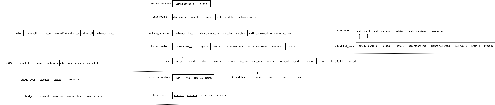
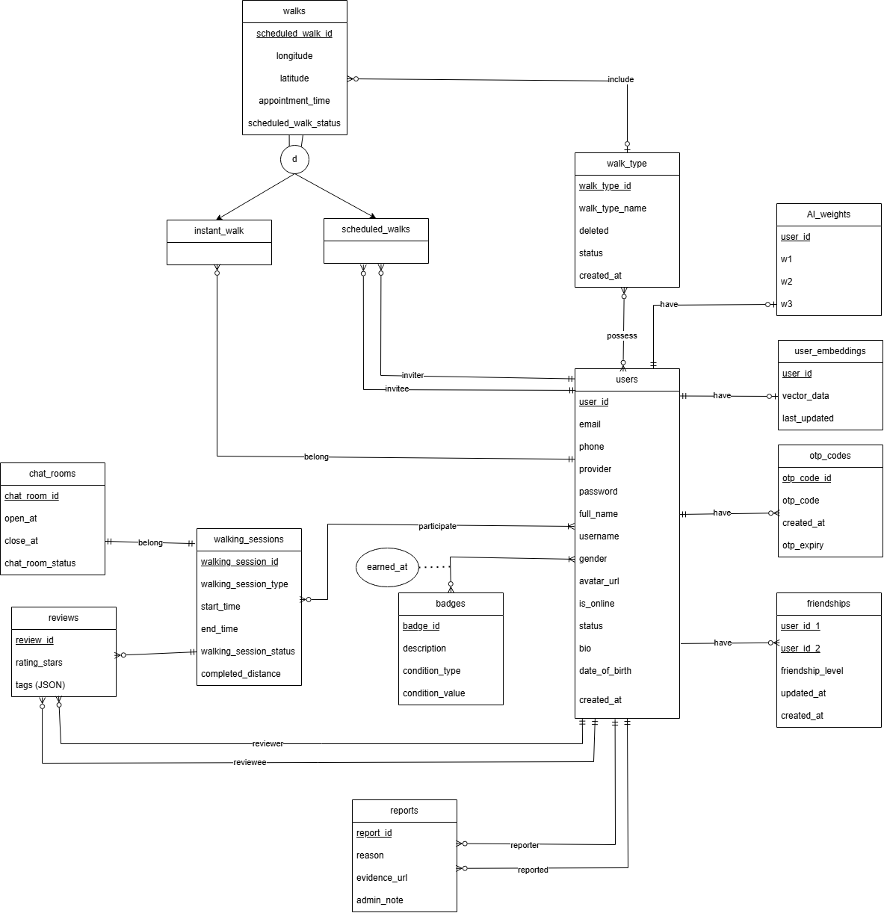

**Task:** : Database Design Documentation – Design the database for the WalkMate system, including analysis of ERD diagrams, the conceptual data model, business rules, the logical data model (with 3NF normalization), foreign keys, indexes, and constraints.

---

## Executive Summary

This part presents a comprehensive database design for the **WalkMate Walking Companion Matching System**, a platform that connects users seeking walking partners. The system facilitates user matching, walking session coordination, real-time communication, and post-activity feedback through ratings and reviews. The design supports both instant and scheduled walking sessions, incorporates AI-driven matching algorithms, and maintains a reputation system through badges and reliability scoring.

---

## 7.1. Conceptual Data Model

### 7.1.1 ER Model

The Entity-Relationship (ER) model represents the logical structure and relationships within the WalkMate system. The model is visualized through two complementary diagrams:

**Figure 1: Comprehensive Database Schema**  
The first diagram illustrates the complete relational database structure, showing all entities and their interconnections including users, walking sessions, chat functionality, social features (friendships), reputation systems (badges, reviews), and administrative features (reports).



_[View interactive diagram](https://app.diagrams.net/#G1cAhyszSCWaz_nH2MtlfBGmB0kE6wtgyb#%7B%22pageId%22%3A%227CWx2EnKrPZ8Q6bgTWRD%22%7D) for detailed exploration_

**Figure 2: Core Entity Relationships**  
The second diagram provides a detailed view of the core entities, emphasizing the inheritance hierarchy for walk types (instant_walk and scheduled_walk) and the central role of walking_sessions in connecting multiple system components.



_[View interactive diagram](https://app.diagrams.net/#G1-SD-eaywOR6Y8V6BCY40wYd37AzwIbvo) for detailed exploration_

**Key Observations:**

- The system uses a **specialization hierarchy** where walks are categorized into instant_walk and scheduled_walk, both inheriting from a base walk concept
- **walking_sessions** serves as the central entity connecting users, walk types, chat rooms, and reviews
- The design supports **bidirectional relationships** (e.g., friendships, user embeddings for AI matching)
- **Temporal constraints** are embedded through status fields and timestamp attributes

---

### 7.1.2 Entities

The system comprises 16 primary entities organized into functional domains:

#### **User Management Domain**

**1. users**

```
users(user_id, email, phone, provider, password, full_name, username, gender,
      avatar_url, is_online, status, bio, date_of_birth, created_at)
```

- **Purpose:** Central entity storing all user profile information and authentication credentials
- **Primary Key:** `user_id`
- **Description:** Represents system users who can create walking intentions, participate in sessions, and interact socially. The `provider` field supports multiple authentication methods (local, OAuth providers). The `status` field tracks account state (active, suspended, deleted).

**2. otp_codes**

```
otp_codes(otp_code_id, otp_code, created_at, otp_expiry)
```

- **Purpose:** Manages one-time passwords for authentication and verification
- **Primary Key:** `otp_code_id`
- **Description:** Supports secure authentication flows including email verification, password reset, and two-factor authentication. OTP codes have expiration timestamps for security.

#### **Walking Activity Domain**

**3. walk_type**

```
walk_type(walk_type_id, walk_type_name, deleted, status, created_at)
```

- **Purpose:** Categorizes walking activities (e.g., casual walk, fitness walk, sightseeing)
- **Primary Key:** `walk_type_id`
- **Description:** Master data table defining available walking categories. Supports soft deletion through the `deleted` flag.

**4. instant_walk**

```
instant_walk(instant_walk_id, longitude, latitude, appointment_time,
             instant_walk_status, walk_type_id, user_id, invitee_id)
```

- **Purpose:** Represents immediate walking requests created by users
- **Primary Key:** `instant_walk_id`
- **Foreign Keys:** `walk_type_id` → walk_type, `user_id` → users, `invitee_id` → users
- **Description:** Supports spontaneous walk matching. Status transitions: PENDING → MATCHED → CONFIRMED → IN_PROGRESS → COMPLETED/CANCELLED/NO_SHOW

**5. scheduled_walk**

```
scheduled_walk(scheduled_walk_id, longitude, latitude, appointment_time,
               scheduled_walk_status, walk_type_id, inviter_id, invitee_id)
```

- **Purpose:** Represents pre-planned walking sessions between specific users
- **Primary Key:** `scheduled_walk_id`
- **Foreign Keys:** `walk_type_id` → walk_type, `inviter_id` → users, `invitee_id` → users
- **Description:** Allows users to schedule walks in advance with chosen partners. Follows similar state transitions as instant walks but with additional timeout rules.

**6. walking_sessions**

```
walking_sessions(walking_session_id, walking_session_type, start_time, end_time,
                 walking_session_status, completed_distance)
```

- **Purpose:** Core entity tracking active walking sessions
- **Primary Key:** `walking_session_id`
- **Description:** Represents the actual execution of a walk. Created when instant_walk or scheduled_walk transitions to IN_PROGRESS. Tracks duration and distance. Status values: IN_PROGRESS, COMPLETED, CANCELLED.

**7. session_participants**

```
session_participants(walking_session_id, user_id)
```

- **Purpose:** Junction table linking users to walking sessions
- **Primary Key:** Composite (`walking_session_id`, `user_id`)
- **Foreign Keys:** `walking_session_id` → walking_sessions, `user_id` → users
- **Description:** Enforces the constraint that exactly 2 users participate in each session.

#### **Communication Domain**

**8. chat_rooms**

```
chat_rooms(chat_room_id, open_at, close_at, chat_room_status, walking_session_id)
```

- **Purpose:** Manages chat channels for walking sessions
- **Primary Key:** `chat_room_id`
- **Foreign Key:** `walking_session_id` → walking_sessions
- **Description:** Each walking session has one associated chat room. Status indicates OPEN (active session) or CLOSED (session completed/cancelled).

**9. reviews**

```
reviews(review_id, rating_stars, tags (JSON), reviewer_id, reviewee_id, walking_session_id)
```

- **Purpose:** Stores post-session ratings and feedback
- **Primary Key:** `review_id`
- **Foreign Keys:** `reviewer_id` → users, `reviewee_id` → users, `walking_session_id` → walking_sessions
- **Description:** Bidirectional rating system where both participants can rate each other. The `tags` field (JSON) stores structured feedback tags. Constrained to COMPLETED sessions only.

#### **Social & Reputation Domain**

**10. badges**

```
badges(badge_id, description, condition_type, condition_value)
```

- **Purpose:** Defines achievement badges users can earn
- **Primary Key:** `badge_id`
- **Description:** Master data for gamification. Examples include "10 Walks Completed", "Early Bird" (walks before 6 AM), "Social Butterfly" (10+ friends).

**11. badge_user**

```
badge_user(badge_id, user_id, earned_at)
```

- **Purpose:** Junction table tracking user badge acquisitions
- **Primary Key:** Composite (`badge_id`, `user_id`)
- **Foreign Keys:** `badge_id` → badges, `user_id` → users
- **Description:** Records when users achieve badges. Supports leaderboards and profile displays.

**12. friendships**

```
friendships(user_id_1, user_id_2, friendship_level, created_at, updated_at)
```

- **Purpose:** Manages user-to-user friendship relationships
- **Primary Key:** Composite (`user_id_1`, `user_id_2`)
- **Foreign Keys:** `user_id_1` → users, `user_id_2` → users
- **Description:** Symmetric relationship requiring only one record per friendship (enforced by constraint `user_id_1 < user_id_2`). The `friendship_level` indicates relationship strength based on walk count together.

#### **AI Matching Domain**

**13. user_embeddings**

```
user_embeddings(user_id, vector_data, last_updated)
```

- **Purpose:** Stores AI-generated user profile embeddings for similarity matching
- **Primary Key:** `user_id`
- **Foreign Key:** `user_id` → users
- **Description:** Vector representations (likely high-dimensional) of user characteristics derived from walking history, preferences, and behavior. Updated periodically for accurate matching.

**14. AI_weights**

```
AI_weights(user_id, w1, w2, w3)
```

- **Purpose:** Personalized weighting factors for matching algorithm
- **Primary Key:** `user_id`
- **Foreign Key:** `user_id` → users
- **Description:** User-specific weights for various matching criteria (e.g., w1=location proximity, w2=interest similarity, w3=reliability score). Enables personalized matching experiences.

#### **Administrative Domain**

**15. reports**

```
reports(report_id, reason, evidence_url, admin_note, reporter_id, reported_id)
```

- **Purpose:** Manages user-generated reports of misconduct or issues
- **Primary Key:** `report_id`
- **Foreign Keys:** `reporter_id` → users, `reported_id` → users
- **Description:** Supports moderation and safety. Evidence can include screenshots or session logs. Admin notes track resolution actions.

---

### 7.1.3 Relationships Between Entities

The following table describes all significant relationships in the system:

| No  | Entity 1         | Entity 2             | Cardinality | Description                                                           | Attributes                         |
| --- | ---------------- | -------------------- | ----------- | --------------------------------------------------------------------- | ---------------------------------- |
| 1   | users            | instant_walk         | 1..N        | A user can create multiple instant walk requests                      | Created walks belong to one user   |
| 2   | users            | instant_walk         | 1..N        | A user can be invited to multiple instant walks                       | Foreign key: invitee_id            |
| 3   | users            | scheduled_walk       | 1..N        | A user can initiate multiple scheduled walks                          | Foreign key: inviter_id            |
| 4   | users            | scheduled_walk       | 1..N        | A user can be invited to multiple scheduled walks                     | Foreign key: invitee_id            |
| 5   | walk_type        | instant_walk         | 1..N        | Each walk type can be associated with many instant walks              | Categorizes walk purpose           |
| 6   | walk_type        | scheduled_walk       | 1..N        | Each walk type can be associated with many scheduled walks            | Categorizes walk purpose           |
| 7   | instant_walk     | walking_sessions     | 0..1        | An instant walk may result in one walking session                     | Only if status reaches IN_PROGRESS |
| 8   | scheduled_walk   | walking_sessions     | 0..1        | A scheduled walk may result in one walking session                    | Only if status reaches IN_PROGRESS |
| 9   | walking_sessions | session_participants | 1..2        | Each session has exactly 2 participants                               | Junction table for M:N             |
| 10  | users            | session_participants | 1..N        | A user can participate in multiple sessions                           | Junction table for M:N             |
| 11  | walking_sessions | chat_rooms           | 1..1        | Each session has exactly one chat room                                | One-to-one relationship            |
| 12  | walking_sessions | reviews              | 1..2        | Each completed session can have 2 reviews (one from each participant) | Bidirectional rating               |
| 13  | users            | reviews              | 1..N        | A user can write multiple reviews                                     | Foreign key: reviewer_id           |
| 14  | users            | reviews              | 1..N        | A user can receive multiple reviews                                   | Foreign key: reviewee_id           |
| 15  | users            | friendships          | M..N        | Users can have multiple friendships                                   | Self-referencing many-to-many      |
| 16  | badges           | badge_user           | 1..N        | Each badge can be earned by multiple users                            | Junction table                     |
| 17  | users            | badge_user           | 1..N        | Each user can earn multiple badges                                    | Junction table                     |
| 18  | users            | user_embeddings      | 1..1        | Each user has one embedding vector                                    | One-to-one for AI matching         |
| 19  | users            | AI_weights           | 1..1        | Each user has personalized matching weights                           | One-to-one configuration           |
| 20  | users            | reports              | 1..N        | A user can file multiple reports                                      | Foreign key: reporter_id           |
| 21  | users            | reports              | 1..N        | A user can be reported multiple times                                 | Foreign key: reported_id           |

**Cardinality Constraints:**

- **(1..N):** One-to-many relationship
- **(M..N):** Many-to-many relationship (requires junction table)
- **(1..1):** One-to-one relationship
- **(0..1):** Optional one-to-one relationship

**Special Relationship Notes:**

- The **walks → walking_sessions** relationship is conditional: sessions are only created when walks reach IN_PROGRESS status
- **friendships** uses a symmetric design where `user_id_1 < user_id_2` to avoid duplicate records
- **session_participants** enforces exactly 2 participants through application logic and CHECK constraints
- **reviews** connects three entities (reviewer, reviewee, session) forming a ternary relationship

---

## 7.2. Business Rules

The system enforces critical business rules to maintain data integrity and ensure proper workflow:

### 7.2.1 Session Participation Rules

**Rule BR-01: Exclusive Session Participation**

- **Statement:** A user can participate in only ONE active walking session at any given time
- **Rationale:** Prevents double-booking and ensures users can fully engage in their current walk
- **Implementation:**
  - Before creating a new session, query `session_participants` joined with `walking_sessions` to verify no active sessions exist for the user
  - Database trigger/check: `COUNT(session_participants WHERE user_id = ? AND session.status = 'IN_PROGRESS') <= 1`
- **Enforcement Level:** Database constraint + application logic

**Rule BR-02: Exactly Two Participants**

- **Statement:** Every walking_session must contain exactly 2 participants, no more, no less
- **Rationale:** System is designed for paired walking, not group activities
- **Implementation:**
  - Composite UNIQUE constraint on `(walking_session_id, user_id)` in session_participants
  - CHECK constraint: `(SELECT COUNT(*) FROM session_participants WHERE walking_session_id = ?) = 2`
  - Application validates participant count before session creation
- **Enforcement Level:** Database constraint + application logic

### 7.2.2 State Transition Rules

**Rule BR-03: Review Eligibility**

- **Statement:** Reviews can ONLY be submitted for walking sessions with status = 'COMPLETED'
- **Rationale:** Ensures ratings reflect actual experiences, not intentions
- **Implementation:**
  - Foreign key constraint with CHECK: `walking_sessions.status = 'COMPLETED'` for referenced sessions
  - Application validates session status before allowing review submission
  - Prevent review updates if session status changes to CANCELLED
- **Enforcement Level:** Application logic + trigger

**Rule BR-04: Match Expiration - Pending State**

- **Statement:** If a walking request remains in PENDING status for 10 minutes without response, it automatically transitions to CANCELLED
- **Rationale:** Prevents stale requests from cluttering the system
- **Implementation:**
  - Scheduled job runs every hour checking: `WHERE status = 'PENDING' AND TIMESTAMPDIFF(MINUTE, created_at, NOW()) >= 10`
  - Updates status to 'CANCELLED' with reason code 'TIMEOUT_PENDING'
  - Notification sent to requester
- **Enforcement Level:** Scheduled system job

**Rule BR-05: Match Expiration - Matched State**

- **Statement:** If matched users fail to confirm meeting details within 5 minutes, the match expires to CANCELLED
- **Rationale:** Encourages prompt coordination and prevents passive matching
- **Implementation:**
  - Reminder notification at 24-hour mark
  - At 5 minutes: transition to CANCELLED with reason 'TIMEOUT_MATCHED'
  - No reliability penalty applied
- **Enforcement Level:** Scheduled system job

**Rule BR-06: No-Show Detection**

- **Statement:** If only one user presses "Start" within 15 minutes after scheduled time, mark absent user as NO_SHOW
- **Rationale:** Protects committed users from being stood up
- **Implementation:**
  - System checks at `appointment_time + 15 minutes`
  - If `COUNT(start_button_pressed) = 1`, transition to NO_SHOW
  - Apply -25 reliability score penalty to absent user
  - If `COUNT(start_button_pressed) = 0`, transition to CANCELLED (no penalties)
- **Enforcement Level:** Scheduled system job + real-time validation

### 7.2.3 Communication Rules

**Rule BR-07: Chat Room Lifecycle**

- **Statement:** Chat rooms exist ONLY during active walking sessions (status = IN_PROGRESS)
- **Rationale:** Limits communication to actual walk coordination
- **Implementation:**
  - Chat room created when session transitions to IN_PROGRESS
  - Chat room closed (status = CLOSED) when session completes or cancels
  - Historical messages preserved for dispute resolution
  - New messages blocked if chat_room_status != 'OPEN'
- **Enforcement Level:** Application logic

**Rule BR-08: Post-Session Communication**

- **Statement:** After session completion, users can communicate only through friendship connections
- **Rationale:** Encourages friendship formation for continued interaction
- **Implementation:**
  - Session chat rooms become read-only after closure
  - New chat requires friendship record in friendships table
  - "Add Friend" prompt shown at session completion
- **Enforcement Level:** Application logic

### 7.2.4 Social Relationship Rules

**Rule BR-09: Symmetric Friendships**

- **Statement:** Friendships are bidirectional; only one record represents the relationship
- **Rationale:** Prevents duplicate records and simplifies queries
- **Implementation:**
  - Constraint: `user_id_1 < user_id_2` enforced at insertion
  - Queries check both directions: `WHERE (user_id_1 = ? AND user_id_2 = ?) OR (user_id_1 = ? AND user_id_2 = ?)`
  - Application layer normalizes user IDs before insertion
- **Enforcement Level:** Database CHECK constraint + application logic

**Rule BR-10: Friendship Level Calculation**

- **Statement:** Friendship level is determined by number of completed walks together
- **Rationale:** Rewards consistent partnerships
- **Implementation:**
  - Auto-updated after each COMPLETED session
  - Levels: Acquaintance (1-2 walks), Friend (3-9 walks), Best Friend (10+ walks)
  - Trigger updates `friendship_level` based on walk count query
- **Enforcement Level:** Database trigger

### 7.2.5 Reliability & Reputation Rules

**Rule BR-11: Reliability Score Immutability**

- **Statement:** Reliability scores cannot be manually adjusted by users
- **Rationale:** Maintains system integrity and trust
- **Implementation:**
  - No direct user API for score modification
  - Scores updated only through system events (completions, no-shows, cancellations)
  - Admin override requires audit logging
- **Enforcement Level:** Application architecture + audit log

**Rule BR-12: Badge Permanence**

- **Statement:** Once earned, badges cannot be revoked (except by admin for fraud)
- **Rationale:** Preserves achievement motivation
- **Implementation:**
  - No DELETE operation on badge_user in application layer
  - Soft delete with reason required for admin removals
  - Audit trail maintained
- **Enforcement Level:** Application logic + audit system

**Rule BR-13: Cancellation Penalties**

- **Statement:** Cancellation penalties scale based on time remaining before scheduled walk
- **Rationale:** Discourages last-minute cancellations that harm partners
- **Implementation:**
  - \>2 hours before: No penalty (EARLY_CANCEL)
  - <2 hours before: -5 reliability score (LATE_CANCEL)
  - <15 minutes before: -20 reliability score (CRITICAL_CANCEL)
  - No-show: -25 reliability score (USER_MISSING)
- **Enforcement Level:** Calculated penalty function triggered on cancellation

**Rule BR-14: Reliability Tier Restrictions**

- **Statement:** Users below 50 reliability points face matching restrictions
- **Rationale:** Incentivizes good behavior while allowing redemption
- **Implementation:**
  - Restricted tier: Maximum 1 new match per day for 7 days
  - Caution tier (50-99): Reduced visibility in matching algorithm
  - Verified tier (100-149): Normal operations
  - Elite tier (150+): Priority matching
- **Enforcement Level:** Matching algorithm logic

### 7.2.6 Data Integrity Rules

**Rule BR-15: Temporal Consistency**

- **Statement:** Session end_time must be greater than start_time
- **Rationale:** Prevents illogical time ranges
- **Implementation:**
  - CHECK constraint: `end_time > start_time`
  - Application validates before insertion
- **Enforcement Level:** Database constraint

**Rule BR-16: Geospatial Validity**

- **Statement:** Longitude must be [-180, 180] and latitude [-90, 90]
- **Rationale:** Ensures valid GPS coordinates
- **Implementation:**
  - CHECK constraints on instant_walk and scheduled_walk
  - Application validates coordinates before storage
- **Enforcement Level:** Database constraint + application validation

**Rule BR-17: Rating Value Range**

- **Statement:** rating_stars must be integer values between 1 and 5 inclusive
- **Rationale:** Standard 5-star rating system
- **Implementation:**
  - CHECK constraint: `rating_stars BETWEEN 1 AND 5`
  - Application UI enforces through star selector
- **Enforcement Level:** Database constraint

**Rule BR-18: Self-Exclusion**

- **Statement:** Users cannot befriend themselves, review themselves, or report themselves
- **Rationale:** Logical consistency
- **Implementation:**
  - CHECK constraints:
    - friendships: `user_id_1 <> user_id_2`
    - reviews: `reviewer_id <> reviewee_id`
    - reports: `reporter_id <> reported_id`
- **Enforcement Level:** Database constraint

---

## 7.3. Logical Data Model

The following relational schema represents the complete logical design, derived from the ER model:

### Core Schema Definitions

```sql
users(
    user_id [PK],
    email [UNIQUE, NOT NULL],
    phone,
    provider,
    password,
    full_name,
    username [UNIQUE, NOT NULL],
    gender,
    avatar_url,
    is_online [DEFAULT FALSE],
    status [DEFAULT 'active'],
    bio,
    date_of_birth,
    created_at [DEFAULT CURRENT_TIMESTAMP]
)

otp_codes(
    otp_code_id [PK],
    otp_code [NOT NULL],
    created_at [DEFAULT CURRENT_TIMESTAMP],
    otp_expiry [NOT NULL]
)

walk_type(
    walk_type_id [PK],
    walk_type_name [NOT NULL],
    deleted [DEFAULT FALSE],
    status [DEFAULT 'active'],
    created_at [DEFAULT CURRENT_TIMESTAMP]
)

instant_walk(
    instant_walk_id [PK],
    longitude [NOT NULL],
    latitude [NOT NULL],
    appointment_time,
    instant_walk_status [NOT NULL],
    walk_type_id [FK → walk_type.walk_type_id],
    user_id [FK → users.user_id],
    invitee_id [FK → users.user_id]
)

scheduled_walk(
    scheduled_walk_id [PK],
    longitude [NOT NULL],
    latitude [NOT NULL],
    appointment_time [NOT NULL],
    scheduled_walk_status [NOT NULL],
    walk_type_id [FK → walk_type.walk_type_id],
    inviter_id [FK → users.user_id],
    invitee_id [FK → users.user_id]
)

walking_sessions(
    walking_session_id [PK],
    walking_session_type [NOT NULL],
    start_time [NOT NULL],
    end_time,
    walking_session_status [NOT NULL],
    completed_distance
)

session_participants(
    walking_session_id [PK, FK → walking_sessions.walking_session_id],
    user_id [PK, FK → users.user_id]
)

chat_rooms(
    chat_room_id [PK],
    open_at [DEFAULT CURRENT_TIMESTAMP],
    close_at,
    chat_room_status [NOT NULL],
    walking_session_id [FK → walking_sessions.walking_session_id, UNIQUE]
)

reviews(
    review_id [PK],
    rating_stars [NOT NULL],
    tags [JSON],
    reviewer_id [FK → users.user_id],
    reviewee_id [FK → users.user_id],
    walking_session_id [FK → walking_sessions.walking_session_id]
)

badges(
    badge_id [PK],
    description [NOT NULL],
    condition_type [NOT NULL],
    condition_value
)

badge_user(
    badge_id [PK, FK → badges.badge_id],
    user_id [PK, FK → users.user_id],
    earned_at [DEFAULT CURRENT_TIMESTAMP]
)

friendships(
    user_id_1 [PK, FK → users.user_id],
    user_id_2 [PK, FK → users.user_id],
    friendship_level,
    created_at [DEFAULT CURRENT_TIMESTAMP],
    updated_at [DEFAULT CURRENT_TIMESTAMP ON UPDATE CURRENT_TIMESTAMP]
)

reports(
    report_id [PK],
    reason [NOT NULL],
    evidence_url,
    admin_note,
    reporter_id [FK → users.user_id],
    reported_id [FK → users.user_id]
)

user_embeddings(
    user_id [PK, FK → users.user_id],
    vector_data [NOT NULL],
    last_updated [DEFAULT CURRENT_TIMESTAMP]
)

AI_weights(
    user_id [PK, FK → users.user_id],
    w1 [DEFAULT 0.33],
    w2 [DEFAULT 0.33],
    w3 [DEFAULT 0.34]
)
```

### Schema Normalization Analysis

The schema achieves **Third Normal Form (3NF)** with the following characteristics:

1. **1NF (First Normal Form):** All attributes contain atomic values; no repeating groups exist
2. **2NF (Second Normal Form):** All non-key attributes are fully functionally dependent on the entire primary key
3. **3NF (Third Normal Form):** No transitive dependencies exist; non-key attributes depend only on the primary key

**Deliberate Denormalization:**

- `walking_sessions.completed_distance` is stored rather than calculated to avoid repeated GPS point aggregations
- `friendships.friendship_level` is maintained incrementally rather than calculated on-demand for query performance

---

## 7.6. Constraint Rules

Constraints enforce data integrity at the database level:

### Uniqueness Constraints

```sql
UNIQUE (users.email)           -- Prevent duplicate email registrations
UNIQUE (users.username)        -- Ensure unique usernames
UNIQUE (chat_rooms.walking_session_id)  -- One chat room per session
UNIQUE (session_participants.walking_session_id, user_id)  -- No duplicate participants
```

### Check Constraints

#### Status Validation

```sql
CHECK (instant_walk_status IN ('PENDING', 'MATCHED', 'CONFIRMED', 'IN_PROGRESS',
                                'COMPLETED', 'CANCELLED', 'NO_SHOW'))

CHECK (scheduled_walk_status IN ('PENDING', 'MATCHED', 'CONFIRMED', 'IN_PROGRESS',
                                  'COMPLETED', 'CANCELLED', 'NO_SHOW'))

CHECK (walking_session_status IN ('IN_PROGRESS', 'COMPLETED', 'CANCELLED'))

CHECK (chat_room_status IN ('OPEN', 'CLOSED'))

CHECK (users.status IN ('active', 'suspended', 'deleted'))
```

#### Value Range Checks

```sql
CHECK (reviews.rating_stars BETWEEN 1 AND 5)

CHECK (instant_walk.longitude BETWEEN -180 AND 180)
CHECK (instant_walk.latitude BETWEEN -90 AND 90)

CHECK (scheduled_walk.longitude BETWEEN -180 AND 180)
CHECK (scheduled_walk.latitude BETWEEN -90 AND 90)

CHECK (walking_sessions.completed_distance >= 0)

CHECK (AI_weights.w1 >= 0 AND AI_weights.w1 <= 1)
CHECK (AI_weights.w2 >= 0 AND AI_weights.w2 <= 1)
CHECK (AI_weights.w3 >= 0 AND AI_weights.w3 <= 1)
```

#### Self-Exclusion Checks

```sql
CHECK (friendships.user_id_1 <> friendships.user_id_2)
CHECK (friendships.user_id_1 < friendships.user_id_2)  -- Enforce ordering

CHECK (reviews.reviewer_id <> reviews.reviewee_id)

CHECK (reports.reporter_id <> reports.reported_id)

CHECK (instant_walk.user_id <> instant_walk.invitee_id)

CHECK (scheduled_walk.inviter_id <> scheduled_walk.invitee_id)
```

#### Temporal Constraints

```sql
CHECK (walking_sessions.end_time IS NULL OR end_time > start_time)

CHECK (otp_codes.otp_expiry > created_at)

CHECK (chat_rooms.close_at IS NULL OR close_at >= open_at)
```

### NOT NULL Constraints

Critical fields that cannot be null:

```sql
users: email, username, full_name, status
instant_walk: longitude, latitude, instant_walk_status, user_id
scheduled_walk: longitude, latitude, appointment_time, scheduled_walk_status,
                inviter_id, invitee_id
walking_sessions: walking_session_type, start_time, walking_session_status
reviews: rating_stars, reviewer_id, reviewee_id, walking_session_id
badges: description, condition_type
friendships: user_id_1, user_id_2
```
