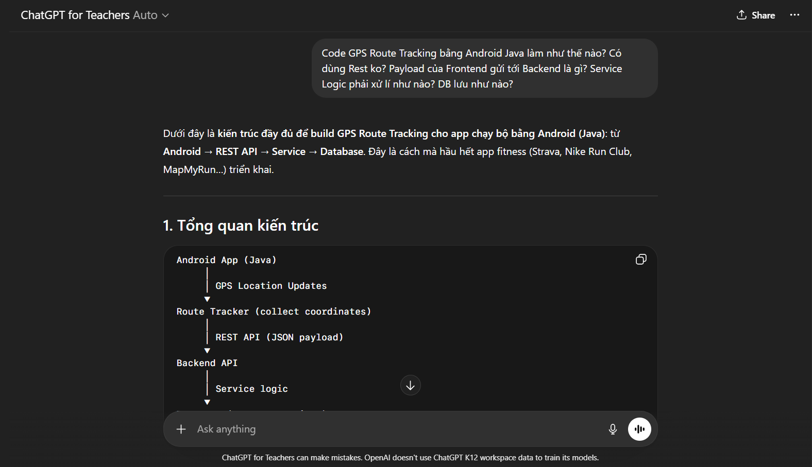
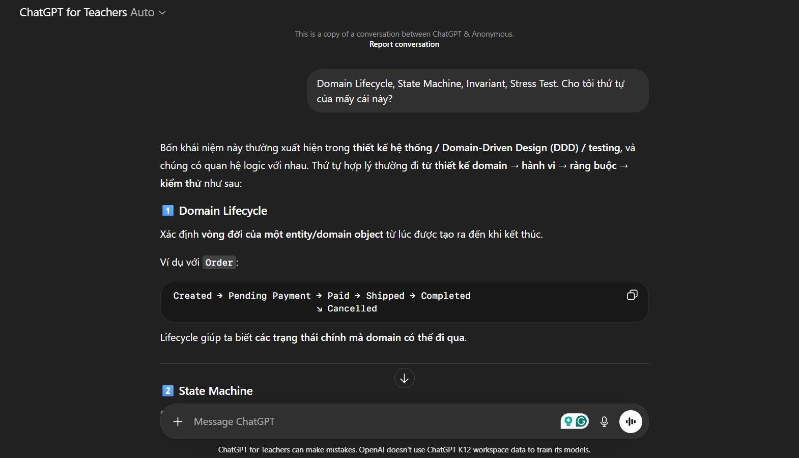

# Weekly Report – Group 09

---

## General Information

| Field            | Value                   |
| ---------------- | ----------------------- |
| **Group ID**     | Group 09                |
| **Project Name** | WalkMate                |
| **Date Range**   | 2026-03-07 – 2026-03-14 |

---

## Tasks Completed This Week

### 23127179 – Nguyễn Bảo Duy

- Implement end-to-end walk session flow
- Status: Not finished. Finished BE implementation. Haven't finish FE yet.
- **Evidence:**
- [Jira task](https://duybaonguyendev.atlassian.net/browse/KAN-26)
- [Github branch](https://github.com/BuhDuy256/WalkMate/tree/features/walk-session)

### 23127006 – Trần Nguyễn Khải Luân

- Implement walk intent flow
- Status: Not finished. Finished BE implementation. Haven't finish FE yet.
- **Evidence:**
- [Jira task](https://duybaonguyendev.atlassian.net/browse/KAN-25)
- [Github branch](https://github.com/BuhDuy256/WalkMate/tree/features/walk-intent)

### 23127438 – Đặng Trường Nguyên

- Task 1 description
- **Evidence:** _(Jira screenshot link / output document / artifact)_

### 23127539 – Nguyễn Thanh Tiến

- Task: Implement rating flow
- Status: Not finished. Just learn about the flow that meet MVVM architecture and implement the UI. Haven't finish the BE implementation yet and the architecture of the flow.
- **Evidence:** _(Jira screenshot link / output document / artifact)_
- [Jira task](https://duybaonguyendev.atlassian.net/browse/KAN-27)
- [Github branch](https://github.com/BuhDuy256/WalkMate/tree/feature/rating)
- [UI Screenshot](https://drive.google.com/file/d/1MRHtxsrDjqBIElg20mKst3uqvNjvAimh/view?usp=sharing)

---

## AI Usage Declaration

### 23127179 – Nguyễn Bảo Duy (Couldn't share link because errors from ChatGPT for Education Model)

- Prompt 1: "Code GPS Route Tracking bằng Android Java làm như thế nào? Có dùng Rest ko? Payload của Frontend gửi tới Backend là gì? Service Logic phải xử lí như nào? DB lưu như nào?"
- **Evidence:** 

- Prompt 2: Domain Lifecycle, State Machine, Invariant, Stress Test. Cho tôi thứ tự của mấy cái này?
- **Evidence:** 

### 23127006 – Trần Nguyễn Khải Luân

- Prompt 1: giải thích về phương pháp thiết kế DDD
- **Evidence:** [ChatGPT](https://chatgpt.com/share/69b5316a-5184-8003-9007-41940983f19e)

- Prompt 2: giải thích cho tôi về DDD
- **Evidence:** [Gemini](https://gemini.google.com/share/e5365736ba73)

### 23127438 – Đặng Trường Nguyên

- Prompt 1: _(paste prompt text)_
- **Evidence:** _(paste AI chat/tool link)_

### 23127539 – Nguyễn Thanh Tiến

- Prompt 1: Giải thích mô hình MVVM-lite + Repository pattern + Backend as Single Source of Truth.
- - **Evidence:** [ChatGPT](https://chatgpt.com/share/69b549fa-9c58-800a-aaeb-eb04e854a726)

---

## Tasks Planned for Next Week

- Finish the uncompleted task in the next week.
