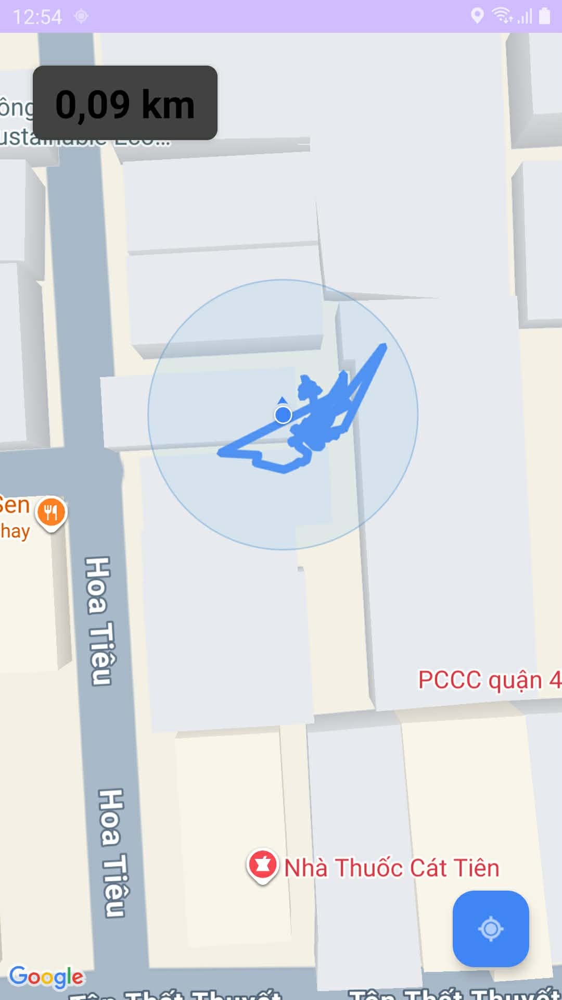

# Weekly Report – Group 09

---

## General Information

| Field            | Value                   |
| ---------------- | ----------------------- |
| **Group ID**     | Group 09                |
| **Project Name** | WalkMate                |
| **Date Range**   | 2026-03-15 – 2026-03-21 |

---

## Tasks Completed This Week

### 23127179 – Nguyễn Bảo Duy

- Task: Implement end-to-end Walk Session domain flow
- Status:
  - Backend: Finish
  - Frontend: Finish GPS Path Tracing Feature with local DB. Didn't complete connecting Frontend with Backend API
- **Evidence:**
  - [Jira task](https://duybaonguyendev.atlassian.net/browse/KAN-26)
  - [Github branch - Backend of WalkSession](https://github.com/BuhDuy256/WalkMate/tree/features/full-walk-session)
  - [Github branch - Frontend of WalkSession](https://github.com/BuhDuy256/WalkMate/tree/feature/fe/gps-path-tracing)
  - 

### 23127006 – Trần Nguyễn Khải Luân

- Task 1 description
- **Evidence:** _(Jira screenshot link / output document / artifact)_

### 23127438 – Đặng Trường Nguyên

- Task 1 description
- **Evidence:** _(Jira screenshot link / output document / artifact)_

### 23127539 – Nguyễn Thanh Tiến

- Task 1 description
- **Evidence:** _(Jira screenshot link / output document / artifact)_

---

## AI Usage Declaration

### 23127179 – Nguyễn Bảo Duy

- **Prompt:**

```
Đây là danh sách câu hỏi của tôi:

- 1. Tôi nên làm giao diện như thế nào? Tôi đang có ý tưởng với option 1 với layouts là 2 tầng: 1 bên trên là Map và 2 bên dưới là các nút: sẽ có 2 button, trạng thái button start, pause, resume, end tùy theo State của Walk Session. Option 2 là maps ở phía sau và chèn một cái lớp chứa button lên trên (kiểu có 2 lớp UI chồng lên nhau và toi nghĩ nó sẽ dễ kiểm soát hơn vì chỉ cần reset cái lớp UI trên chứa button còn cái GPS Path Tracing Layer vẫn work bth).
- 2. Dùng API của Google Maps để code Map? Có API nào free ko?
- 3. Hiện tại tôi đang dùng các component gốc của Android Java chứ ko dùng lib. Nên là tôi ko rõ cần dùng lib gì để làm giao diện đẹp hơn ko?
- 4. Theo như bạn tôi nói là cái Maps nó chỉ cho location thôi, còn muốn vẽ đẹp lên thì cần lib khác.

=> Cho tôi câu trả lời? Tôi ko chỉ muốn có "Được" với "Không" mà bạn cần nhận ra tư duy sai sót ben trong và giảng lại lý thuyết cơ bản nếu tư duy tôi sai để như một bước đệm cho câu trả lời của bạn.
```

_Evidence:_ https://gemini.google.com/share/0d33f1a80b2a

### 23127006 – Trần Nguyễn Khải Luân

- Prompt 1: _(paste prompt text)_
- **Evidence:** _(paste AI chat/tool link)_

### 23127438 – Đặng Trường Nguyên

- Prompt 1: _(paste prompt text)_
- **Evidence:** _(paste AI chat/tool link)_

### 23127539 – Nguyễn Thanh Tiến

- Prompt 1: _(paste prompt text)_
- **Evidence:** _(paste AI chat/tool link)_

---

## Tasks Planned for Next Week

- **Goal:**
  - Finish uncompleted tasks in current week
  - Implement Chat, Noti, History, Profile flow