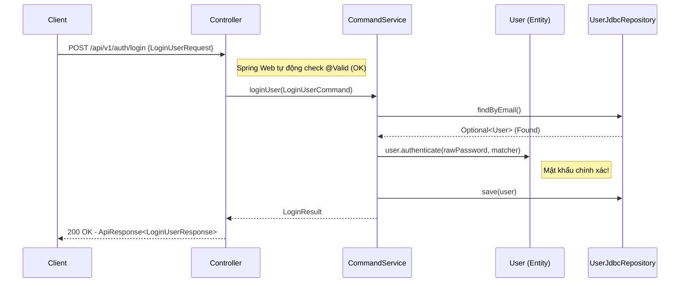
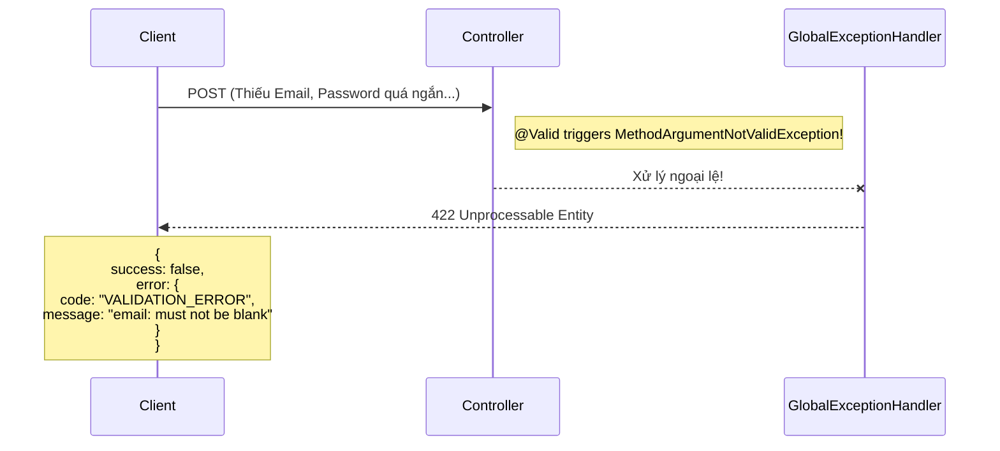
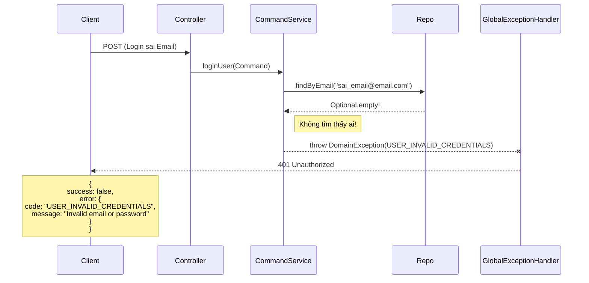
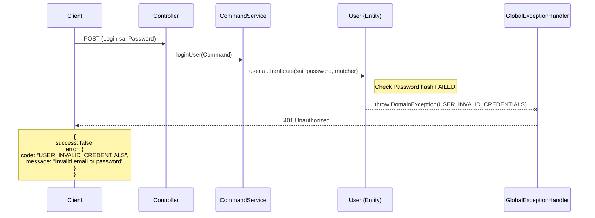
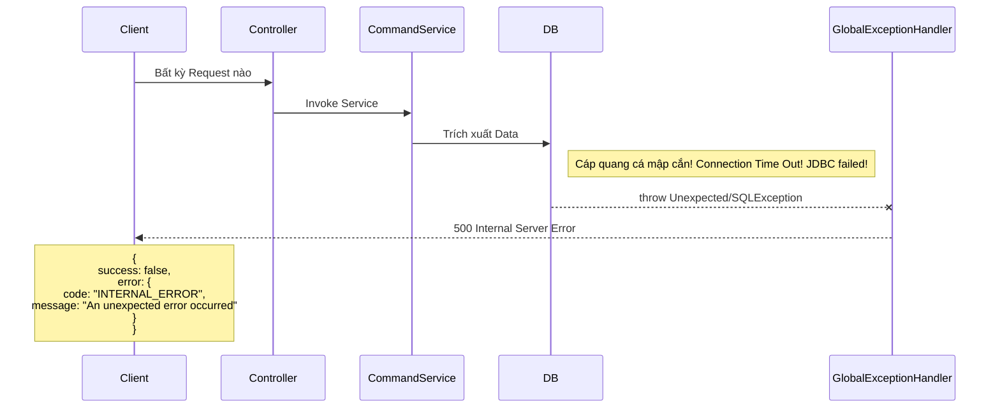

# Kiến Trúc Luồng API (Backend Flow)

Tài liệu này tổng hợp 5 loại luồng (Flows) cơ bản nhất xảy ra trong dự án WalkMate, từ lúc client gửi Request cho đến lúc server trả về Response (Bao gồm cả cấu trúc Lỗi).

---

## 🟢 Flow 1: Nhánh Hoàn Hảo (Happy Path - Success)

Luồng đi tiêu chuẩn khi dữ liệu hợp lệ và thực hiện Use Case thành công.

---

## 🟡 Flow 2: Lỗi Validation Ngay Từ Cửa (Presentation Level 422)

Luồng kiểm duyệt DTO ngay tại cửa ngõ Controller, không cần đụng đến logic bên dưới.

---

## 🟠 Flow 3: Lỗi Điều Phối - Trạng Thái Hệ Thống (Application Level - HTTP Status Động)

Lỗi do Application bắt vì mâu thuẫn dữ liệu từ Repository (VD: Không tìm thấy, Xung đột dữ liệu).

---

## 🔴 Flow 4: Lỗi Nghiệp Vụ Xâu Xa Nằm Trong Lõi (Rich Domain Level - HTTP Status Động)

Lỗi xảy ra sâu bên trong nội tại do bản thân Domain Entity tự bảo vệ mình và từ chối.

---

## 💥 Flow 5: Lỗi Chết Chóc / Bất Ngờ (Global Fallback 500)

Lỗi phát sinh do Server bị ngắt mạng Database, null pointer exception vô tình chưa kiểm soát...

